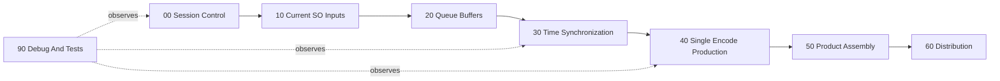

# DataCapture ScriptableObjects

Last updated: 2026-06-12

This document explains the current ScriptableObject resource pool for the data capture pipeline.

## Mental Model

The runtime data bus is split into phase-aligned assets under `Assets/SOData/DataCapture`.

- `Current*`: latest value only, written by capture or production components.
- `*Queue`: timestamped history, written by recorders or production stages.
- `*Configuration`: editable before Play Mode.
- `*State` / `*HealthState`: runtime status and gate decisions.
- `*Request`: one-shot command/request assets.

All implemented SO types now have matching instances. Missing future concepts from the clean-structure plan have been added as lightweight SO types and assets so the Inspector can expose the intended chain.

## Normal Flow

## 00 Session Control

- `Assets/SOData/DataCapture/00_SessionControl/SessionMode.asset` (`LocalOnly / LocalFile` by default; driven by `SessionModeController`)
- `Assets/SOData/DataCapture/00_SessionControl/RecordingSessionState.asset`
- `Assets/SOData/DataCapture/00_SessionControl/RecordingToggleRequest.asset`
- `Assets/SOData/DataCapture/00_SessionControl/OutputRouteGate.asset` (start-recording gate derived from session mode plus PC handshake state)
- `Assets/SOData/DataCapture/00_SessionControl/PCDiscoveryRequest.asset`
- `Assets/SOData/DataCapture/00_SessionControl/PCReceiverConnectionStatus.asset`
- `Assets/SOData/DataCapture/00_SessionControl/RecordingExceptionLog.asset`

## 10 Current SO Inputs

Passthrough camera current assets:

- `Assets/SOData/DataCapture/10_CurrentSOInputs/PassthroughCamera/CurrentCameraImage.asset`
- `Assets/SOData/DataCapture/10_CurrentSOInputs/PassthroughCamera/CurrentCameraFrameTiming.asset`
- `Assets/SOData/DataCapture/10_CurrentSOInputs/PassthroughCamera/CurrentCameraPose.asset`
- `Assets/SOData/DataCapture/10_CurrentSOInputs/PassthroughCamera/CurrentCameraMetadata.asset`
- `Assets/SOData/DataCapture/10_CurrentSOInputs/PassthroughCamera/CurrentCameraStreamState.asset`

Other current inputs:

- `Assets/SOData/DataCapture/10_CurrentSOInputs/VirtualLayer/CurrentVirtualLayerFrame.asset`
- `Assets/SOData/DataCapture/10_CurrentSOInputs/Controller/CurrentControllerPose.asset`
- `Assets/SOData/DataCapture/10_CurrentSOInputs/Headset/CurrentHeadsetPose.asset`
- `Assets/SOData/DataCapture/10_CurrentSOInputs/NetworkDevice/CurrentNetworkDevice.asset`
- `Assets/SOData/DataCapture/10_CurrentSOInputs/CoordinateCalibration/WorldCoordinateFrame.asset`
- `Assets/SOData/DataCapture/10_CurrentSOInputs/CoordinateCalibration/SessionCoordinateCalibration.asset`
- `Assets/SOData/DataCapture/10_CurrentSOInputs/CoordinateCalibration/CoordinateCalibrationResetRequest.asset`

## 20 Queue Buffers

- `Assets/SOData/DataCapture/20_QueueBuffers/PassthroughCamera/CameraImageQueue.asset`
- `Assets/SOData/DataCapture/20_QueueBuffers/PassthroughCamera/CameraFrameTimingQueue.asset`
- `Assets/SOData/DataCapture/20_QueueBuffers/PassthroughCamera/CameraPoseQueue.asset`
- `Assets/SOData/DataCapture/20_QueueBuffers/PassthroughCamera/CameraMetadataQueue.asset`
- `Assets/SOData/DataCapture/20_QueueBuffers/PassthroughCamera/CameraStreamStateQueue.asset`
- `Assets/SOData/DataCapture/20_QueueBuffers/VirtualLayer/VirtualLayerQueue.asset`
- `Assets/SOData/DataCapture/20_QueueBuffers/Controller/ControllerPoseQueue.asset`
- `Assets/SOData/DataCapture/20_QueueBuffers/Headset/HeadsetPoseQueue.asset`
- `Assets/SOData/DataCapture/20_QueueBuffers/NetworkDevice/NetworkDeviceQueue.asset`

## 30 Time Synchronization

- `Assets/SOData/DataCapture/30_TimeSynchronization/SyncConfiguration.asset`
- `Assets/SOData/DataCapture/30_TimeSynchronization/CurrentTimestamp.asset`
- `Assets/SOData/DataCapture/30_TimeSynchronization/CompositeAlignmentConfiguration.asset`
- `Assets/SOData/DataCapture/30_TimeSynchronization/MergedFrameSnapshotQueue.asset`
- `Assets/SOData/DataCapture/30_TimeSynchronization/MetadataTimelineJournal.asset`
- `Assets/SOData/DataCapture/30_TimeSynchronization/SynchronizationHealthState.asset`
- `Assets/SOData/DataCapture/30_TimeSynchronization/TimestampMergerDebugState.asset`

`MergedFrameSnapshotQueue.asset` is the stable synchronized input contract for encoding. `MetadataTimelineJournal.asset` is the intended complete metadata sequence for final artifacts.

`CompositeAlignmentConfiguration.asset` currently includes `VirtualLayerQueue.asset` as a required stream. `MergedFrameSnapshotRecord` carries the matched `VirtualLayerFrameRecord`, so stage 04 can consume the virtual layer chosen by stage 03 rather than reading a mutable current value.

## 40 Single Encode Production

- `Assets/SOData/DataCapture/40_SingleEncodeProduction/EncodingPipelineConfiguration.asset`
- `Assets/SOData/DataCapture/40_SingleEncodeProduction/EncoderConfiguration.asset`
- `Assets/SOData/DataCapture/40_SingleEncodeProduction/EncodedFrameQueue.asset`
- `Assets/SOData/DataCapture/40_SingleEncodeProduction/CurrentEncodedFrame.asset`
- `Assets/SOData/DataCapture/40_SingleEncodeProduction/EncodedAccessUnitQueue.asset`
- `Assets/SOData/DataCapture/40_SingleEncodeProduction/CurrentEncodedAccessUnit.asset`
- `Assets/SOData/DataCapture/40_SingleEncodeProduction/EncodingHealthState.asset`
- `Assets/SOData/DataCapture/40_SingleEncodeProduction/Mp4ArtifactWriterState.asset`
- `Assets/SOData/DataCapture/40_SingleEncodeProduction/FrameIndex.asset`
- `Assets/SOData/DataCapture/40_SingleEncodeProduction/SingleEncodeOutputQueue.asset`
- `Assets/SOData/DataCapture/40_SingleEncodeProduction/Transition/CurrentVideoFrameInput.asset`
- `Assets/SOData/DataCapture/40_SingleEncodeProduction/Transition/VideoFrameInputConfiguration.asset`

`EncodedFrameQueue.asset` is the older frame-level queue. `EncodedAccessUnitQueue.asset` and `CurrentEncodedAccessUnit.asset` are internal stage-04 production buses. `CurrentVideoFrameInput.asset` is now a transitional texture handoff built from `MergedFrameSnapshotQueue.asset`; it should not be treated as the external stage-04 input contract. `FrameIndex.asset` is written by `FrameIndexWriter`: from encoded access units when available, or from the local MP4 metadata sidecar after InstantReplay finalization. `SingleEncodeOutputQueue.asset` is the public stage-04 exit that stage 05 should consume; each record carries video artifact state, timestamp samples, the complete metadata timeline, and the resolved frame-index sequence.

## 50 Product Assembly

- `Assets/SOData/DataCapture/50_ProductAssembly/CaptureOutputQueue.asset`
- `Assets/SOData/DataCapture/50_ProductAssembly/CurrentCaptureOutput.asset`
- `Assets/SOData/DataCapture/50_ProductAssembly/EncodedOutputBindingConfiguration.asset`
- `Assets/SOData/DataCapture/50_ProductAssembly/RealtimeAlignedStreamQueue.asset`
- `Assets/SOData/DataCapture/50_ProductAssembly/SessionArtifactManifest.asset`
- `Assets/SOData/DataCapture/50_ProductAssembly/SessionFinalizeState.asset`

`RealtimeAlignedStreamQueue.asset` is for realtime aligned video + metadata records. `SessionArtifactManifest.asset` is for the complete MP4 + metadata timeline + frame index product.

Stage 05 now has scene-mounted builders:

- `RealtimeAlignedStreamQueueBuilder` builds streaming records from `EncodedAccessUnitQueue.asset` plus `MetadataTimelineJournal.asset`. It only runs when the current `NetworkSenderConfiguration.outputTarget` requires network streaming.
- `SessionArtifactManifestBuilder` builds the complete MP4/session artifact manifest from `Mp4ArtifactWriterState.asset`, `MetadataTimelineJournal.asset`, `FrameIndex.asset`, and `EncodedAccessUnitQueue.asset`.
- `SessionFinalizeController` evaluates publish/quarantine after recording stops using the current `outputTarget`: `LocalFile` requires MP4 only, `RemoteReceiver` / `SelfReceiver` require realtime stream only, and `RemoteAndLocalFile` / `SelfAndLocalFile` require both products. It now prefers `SingleEncodeOutputQueue.asset` for metadata timeline, frame-index, and video artifact completeness, with the older direct SO inputs as fallback.

`CaptureOutputQueue.asset` is legacy/compatibility output. `SingleEncodeOutputProductBuilder` is the stage-05 adapter for the stage-04 public output and should be the preferred bridge from `SingleEncodeOutputQueue.asset` into `RealtimeAlignedStreamQueue.asset`, `SessionArtifactManifest.asset`, and `SessionFinalizeState.asset`.

## 60 Distribution

- `Assets/SOData/DataCapture/60_Distribution/NetworkSenderConfiguration.asset`
- `Assets/SOData/DataCapture/60_Distribution/CaptureTransmissionGate.asset`
- `Assets/SOData/DataCapture/60_Distribution/DistributionGateState.asset`
- `Assets/SOData/DataCapture/60_Distribution/CurrentNetworkPacket.asset`
- `Assets/SOData/DataCapture/60_Distribution/NetworkPacketQueue.asset`
- `Assets/SOData/DataCapture/60_Distribution/LocalFileArtifactConsumerState.asset`
- `Assets/SOData/DataCapture/60_Distribution/NetworkFramePacketConsumerState.asset`
- `Assets/SOData/DataCapture/60_Distribution/NetworkFileArtifactConsumerState.asset`
- `Assets/SOData/DataCapture/60_Distribution/LocalSessionArtifactStoreState.asset`

Distribution assets should only consume products from `50_ProductAssembly`; they should not trigger new rendering or encoding.

## 90 Debug And Tests

- `Assets/SOData/DataCapture/90_DebugAndTests/QueueDebug_Camera.asset`
- `Assets/SOData/DataCapture/90_DebugAndTests/QueueDebug_VirtualLayer.asset`
- `Assets/SOData/DataCapture/90_DebugAndTests/QueueDebug_Controller.asset`
- `Assets/SOData/DataCapture/90_DebugAndTests/QueueDebug_Headset.asset`
- `Assets/SOData/DataCapture/90_DebugAndTests/SOFieldWriteRequest.asset`
- `Assets/SOData/DataCapture/90_DebugAndTests/SORegistryListRequest.asset`
- `Assets/SOData/DataCapture/90_DebugAndTests/PassthroughState.asset`
- `Assets/SOData/DataCapture/90_DebugAndTests/DebugImageStreamSettings.asset`
- `Assets/SOData/DataCapture/90_DebugAndTests/Legacy/SoDrivenTests/*`

Legacy-only per-test SO assets remain under `90_DebugAndTests/Legacy/SoDrivenTests`. Do not bind new production components to those legacy request/state assets.

## Usually Edit

- `SessionMode.asset`
- `OutputRouteGate.asset`
- `SyncConfiguration.asset`
- `CompositeAlignmentConfiguration.asset`
- `EncodingPipelineConfiguration.asset`
- `EncoderConfiguration.asset`
- `NetworkSenderConfiguration.asset`

## Usually Do Not Edit

- runtime `Current*` assets
- runtime `*Queue` assets
- `*HealthState` and diagnostics assets, except when debugging or resetting state
