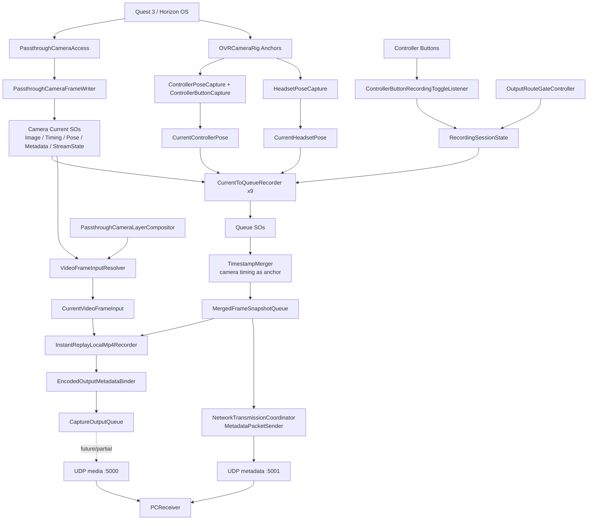
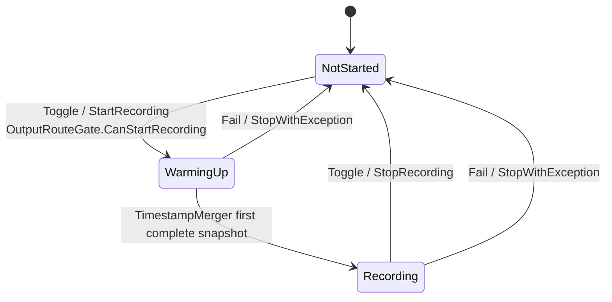

# Q3 Data Collection 数据采集链路分析

Last updated: 2026-06-12

## 结论摘要

当前 Unity 项目的主运行场景是 `Assets/Scenes/SampleScene.unity`，Build Settings 只启用了这一场景。场景里的采集系统挂在 `DataCapture_Runtime` 根节点下，采用 ScriptableObject 作为运行时数据总线：

```text
硬件/API 当前值 -> Current* SO -> Queue SO -> TimestampMerger -> MergedFrameSnapshotQueue
```

摄像头数据来自 Meta `PassthroughCameraAccess`，脚本 `PassthroughCameraFrameWriter` 把同一帧拆成图像、时间、相机 pose、相机 metadata、stream state 五组 Current SO。控制器和头显 pose 也写入 Current SO，再在录制状态为 `WarmingUp` 或 `Recording` 时写入 Queue SO。

Meta 官方文档已在本次分析中核验：`PassthroughCameraAccess` 提供 `GetTexture()`、`Intrinsics`、`GetCameraPose()`、`CurrentResolution`、`Timestamp` 等信息，但它不是现成的视频编码流。官方来源：`https://developers.meta.com/horizon/llmstxt/documentation/unity/unity-pca-migration-from-webcamtexture.md`

## 当前场景入口

Build Settings:

```text
Assets/Scenes/SampleScene.unity
```

活跃场景根节点:

```text
Directional Light
Global Volume
[BuildingBlock] Camera Rig
[BuildingBlock] Passthrough
[BuildingBlock] Passthrough Camera Access
DataCapture_Runtime
```

`DataCapture_Runtime` 分层:

```text
00_Handshake_RecordingControl
10_CurrentSOInputs
20_QueueBuffers
30_Synchronization
40_EncodingDecode
50_EncodingNetwork
50_NetworkSend
80_StatusPreview
90_AI_AutoDebug
```

## 运行时数据流



## 录制状态机

核心脚本:

- `Assets/SObasic/Runtime/CurrentQueueBridge/RecordingSessionController.cs`
- `Assets/SObasic/Runtime/CurrentQueueBridge/RecordingSessionStateSO.cs`
- `Assets/DataCapture/Runtime/00_SessionControl/ModeSelection/SessionModeController.cs`
- `Assets/DataCapture/Runtime/00_SessionControl/RoutePolicy/OutputRouteGateController.cs`
- `Assets/DataCapture/Runtime/00_SessionControl/NetworkHandshake/LanDiscoveryClient.cs`

状态:



实际触发:

- `RecordingButton_SOListener` 监听 `CurrentControllerPose` 中的左手 `SecondaryButton`，按下后写 `RecordingToggleRequest.asset`。
- `RecordingToggleRequestConsumer` 调用 `RecordingSessionController.ToggleRecording()`。
- `RecordingSessionController` 先检查 `OutputRouteGateSO.CanStartRecording`。
- `SessionModeController` 读取 `SessionMode.asset`；当前为 `LocalOnly / LocalFile`，并同步 `NetworkSenderConfiguration.asset.outputTarget = LocalFile`。
- `OutputRouteGateController` 优先按 `SessionMode.asset` 判断是否需要网络握手；当前 `OutputRouteGate.asset` 为 `canStartRecording = true`、`requiresNetworkHandshake = false`。
- 如果切回 `NetworkOrHybrid`，`OutputRouteGateController` 会要求 `PCReceiverConnectionStatusSO.CanStartRecording` 为 true，并启用 `LanDiscoveryClient`。

## 采集内容

### Passthrough Camera

脚本:

- `Assets/DataCapture/CameraCapture/PassthroughCamera/PassthroughCameraFrameWriter.cs`

来源:

- `[BuildingBlock] Passthrough Camera Access`
- `PassthroughCameraAccess.GetTexture()`
- `PassthroughCameraAccess.Timestamp`
- `PassthroughCameraAccess.GetCameraPose()`
- `PassthroughCameraAccess.Intrinsics`
- `PassthroughCameraAccess.CurrentResolution`
- `PassthroughCameraAccess.IsUpdatedThisFrame`

输出 Current SO:

- `CurrentCameraImage.asset`
- `CurrentCameraFrameTiming.asset`
- `CurrentCameraPose.asset`
- `CurrentCameraMetadata.asset`
- `CurrentCameraStreamState.asset`

### Controller / Headset

脚本:

- `Assets/DataCapture/Runtime/10_CurrentSOInputs/Controller/ControllerPoseCapture.cs`
- `Assets/DataCapture/Runtime/10_CurrentSOInputs/Controller/ControllerButtonCapture.cs`
- `Assets/DataCapture/Runtime/10_CurrentSOInputs/Headset/HeadsetPoseCapture.cs`

来源:

- `LeftControllerAnchor`
- `RightControllerAnchor`
- `CenterEyeAnchor`
- OVRInput fallback 仅在 anchor 缺失时使用

输出:

- `CurrentControllerPose.asset`
- `CurrentHeadsetPose.asset`

### Queue 和同步

场景中共有 9 个 `CurrentToQueueRecorder`:

- 5 个 camera split stream
- `VirtualLayerFrame`
- `ControllerPose`
- `HeadsetPose`
- `NetworkDevice_PLACEHOLDER`

`TimestampMerger` 以 `CameraFrameTimingQueue.asset` 为锚，当前 required streams 来自 `CompositeAlignmentConfiguration.asset`:

- `CameraImageQueue.asset`
- `CameraPoseQueue.asset`
- `CameraMetadataQueue.asset`
- `CameraStreamStateQueue.asset`
- `ControllerPoseQueue.asset`

未参与当前合并的队列:

- `VirtualLayerQueue.asset`
- `HeadsetPoseQueue.asset`
- `NetworkDeviceQueue.asset`

## 编码和输出现状

当前配置文件:

- `EncodingPipelineConfiguration.asset`
  - `outputMode: 2` = `LocalMp4Save`
  - `pipelineMode: 2` = `VideoOnly`
  - `videoEncoderBackend: 1` = `AndroidMediaCodecH264`
- `VideoFrameInputConfiguration.asset`
  - `sourceKind: 1` = `PassthroughUnityComposite`
  - `fallbackToRawCameraImage: true`
- `EncoderConfiguration.asset`
  - `codec: DEBUG_JPEG`
  - `targetWidth/Height: 320x320`
  - `targetFrameRate: 2`

场景实际接线:

- `10_SharedVideoFrameInput` 会从 compositor 或 raw camera image 解析到 `CurrentVideoFrameInput.asset`。
- `15_PassthroughUnityCompositor` 已挂载，但 `OverlayRenderTexture`、`CompositeRenderTexture`、`layerCamera` 当前为空；因此 composite 是否有效取决于运行时创建逻辑。
- `20_LocalMp4Save` 使用 `InstantReplayLocalMp4Recorder`，只在 Android Player 且 `AllowsLocalMp4Save` 为 true 时跟随 `RecordingSessionState.IsRecording` 开始录制。
- `30_DebugLowFpsImage` 在场景中 inactive，里面的 `AsyncDebugJpegNetworkStreamer` 不会自动发送 JPEG。
- `10_VideoEncoding_PLACEHOLDER/EncodedFrameQueueWriter_PLACEHOLDER_H264_H265` 仍是占位节点，没有实际组件。
- `NetworkTransmissionCoordinator` 只发送 `MergedFrameSnapshotQueue` 里的 metadata，不发送 `CaptureOutputQueue` 里的 MP4 artifact 或 H264/H265 frame packet。

## PC Receiver 输出

PC 端在 `PCReceiver/q3dc_receiver.py`:

- discovery UDP: `49000`
- metadata UDP: `5001`
- media UDP: `5000`
- session 目录默认在 `captures/q3dc_session_YYYYMMDD_HHMMSS`

当前 receiver 会保存:

- `session_manifest.json`
- `global_status.json`
- `frames/current_frame_state.json`
- `frames/frame_state.jsonl`
- `frames/images/*.jpg`
- `frames/video_packets/*.h264` / `*.h265`
- `discovery/discovery_events.jsonl`
- `logs/receiver.log`

但当 Unity 当前输出模式是 `LocalMp4Save` 时，PC receiver 不一定会收到 video/media 包；它只会在网络输出路径实际发送时记录这些文件。

## 我认为存在的问题

1. 当前文档和当前场景配置有偏差

   旧 `.agent-docs` 仍描述 Debug JPEG 发送链路，但 `SampleScene` 当前配置是 `LocalMp4Save + VideoOnly`，且 Debug JPEG GameObject inactive。继续按旧文档调试会误判“为什么 PC 没收到 JPEG”。

2. `EncoderConfiguration.asset` 与 `EncodingPipelineConfiguration.asset` 表意冲突

   pipeline 选择了 `AndroidMediaCodecH264` / `VideoOnly`，但 encoder config 的 `codec` 仍是 `DEBUG_JPEG`、2 FPS、320x320。这可能让 `CurrentVideoFrameInput` 的解析参数和实际目标编码路线不一致。

3. 录制停止时会清空大量运行队列

   `RecordingSessionController.clearQueuesWhenRecordingStops = true`，停止后会清 camera、pose、merged、encoded、network 等队列。对“现场调试”和“事后追证”不友好，尤其采集类项目需要保留失败瞬间的数据。

4. warmup 完成后 TimestampMerger 也会清输入队列

   `TimestampMerger.clearInputQueuesOnWarmupComplete = true`。这能避免 warmup 脏数据进入正式窗口，但也会丢掉 warmup 到 recording 切换的上下文；如果第一帧问题发生在边界处，很难复盘。

5. Controller 是 required stream，手柄未有效追踪会阻塞正式 merged snapshot

   `CompositeAlignmentConfiguration.asset` 把 ControllerPose 设置为 required。若手柄未唤醒、anchor pose 为零值或按钮模拟污染 CurrentControllerPose，`TimestampMerger` 可能一直停在 `WaitingForRequiredSources` 或输出不可发送 snapshot。

6. Headset pose 被采集但不参与合并

   `HeadsetPoseQueue.asset` 会记录，但当前 `CompositeAlignmentConfiguration.asset` 没有配置它。PC 端默认也不导出 headset pose。若下游算法需要 CenterEye 或头显姿态，需要显式说明“不在主同步包里”。

7. `NetworkDevice` 是 placeholder 但仍有 recorder

   场景有 `40_NetworkDevice_CurrentWriter_PLACEHOLDER` 和 `Recorder_NetworkDevice_PLACEHOLDER`，但 writer 没组件。它不会进入当前 alignment，但会增加场景理解成本，也可能在未来误接入。

8. Local MP4 和网络发送是两条未完全统一的路线

   `InstantReplayLocalMp4Recorder` 能发布 `CaptureOutputRecord(FileArtifact)`，但 `NetworkTransmissionCoordinator` 不消费 `CaptureOutputQueue`。因此“录成 MP4”和“PC receiver 收到文件/视频”不是同一条完成链路。

9. H264/H265 access unit bus 仍未接入生产场景

   场景中存在占位 GameObject，但实际 `NetworkFramePacketSender` / `NetworkFileArtifactSender` / `LocalArtifactStore` 一类 consumer 尚未完成。现有 PC receiver 能接收 H264/H265 包，但 Unity SampleScene 没有把真实 access unit 推过去。

10. SO 作为运行时数据总线会污染 asset 状态

    大量 `Current*`、`Queue*`、diagnostics 都是 asset。Play Mode、编辑器、调试工具都会改这些 asset 字段，容易造成场景 dirty、版本控制噪声、以及“上一次运行残留状态”影响下一次判断。

11. 自动调试节点默认不运行

    `SO_Debug_Probe.runOnStart = false`，旧的 SO driven tests 也是 `autoRunOnEnable = false`。所以场景启动并不会自动证明整条链路健康；需要人工触发或外部 SO write request。

12. PCReceiver 新旧数据布局不完全兼容

    旧 overlay 文档提到 `metadata/merged_metadata.jsonl` 和 `video/video_headers.jsonl`，但当前 receiver 默认写 `frames/frame_state.jsonl`、`frames/images`、`frames/video_packets`。离线工具需要适配新布局，否则会出现“采集成功但离线工具找不到数据”的错觉。

## 建议的下一步

1. 先决定当前阶段的唯一验收目标：`LocalMp4Save`、`Debug JPEG network`、还是 `H264/H265 access unit bus`。
2. 把 `EncodingPipelineConfiguration.asset`、`EncoderConfiguration.asset`、`SampleScene` active/inactive 节点统一到这个目标。
3. 临时关闭停止时清队列，至少在调试期保留最近一次 session 的 SO 队列。
4. 给 ControllerPose 加有效性检查，不要只因为有 timestamp 就当 required stream 满足。
5. 把 `CaptureOutputQueue` 的下游 consumer 补齐，否则 MP4 artifact 和 encoded frame packet 不会自然进入 PC receiver。
6. 更新离线 overlay 工具，让它读取当前 PCReceiver 的 `frames/frame_state.jsonl` 和 `frames/images` 布局。
