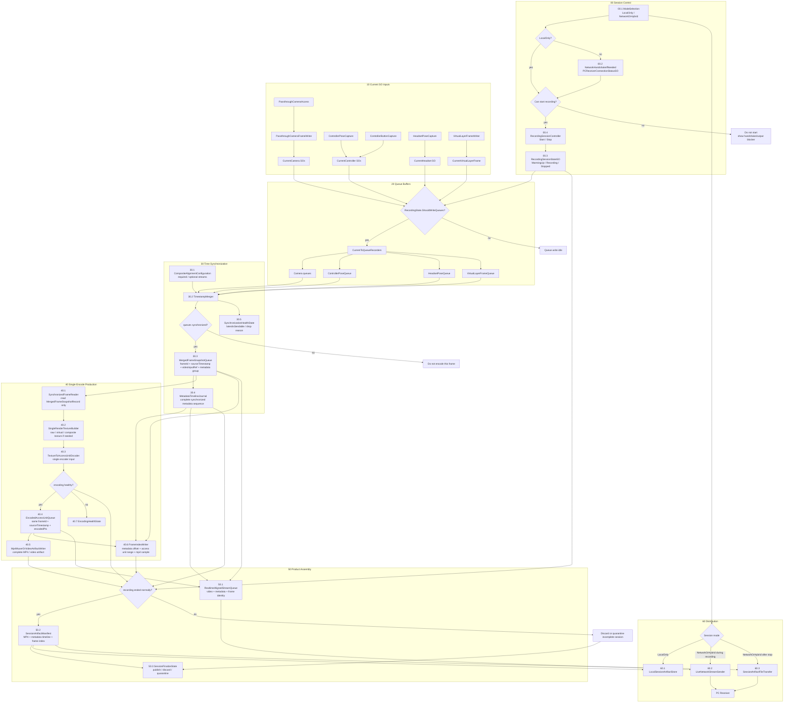
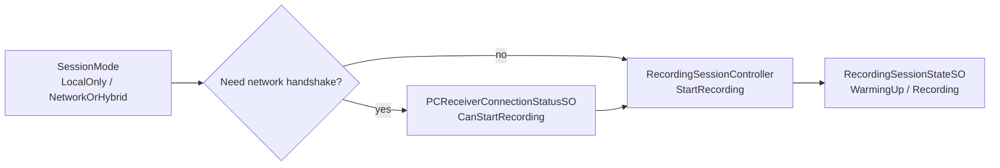
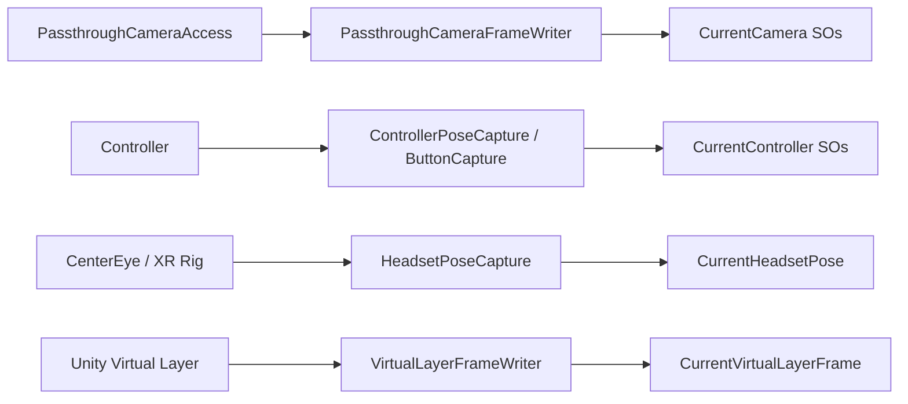
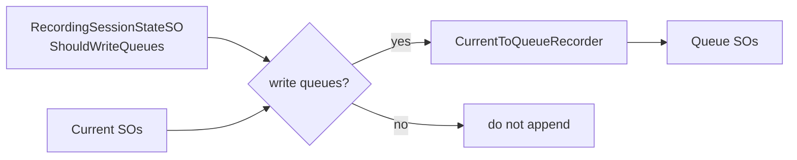
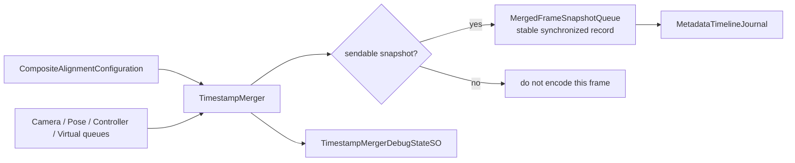
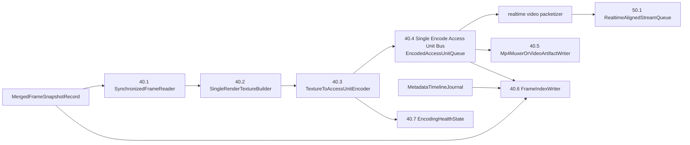
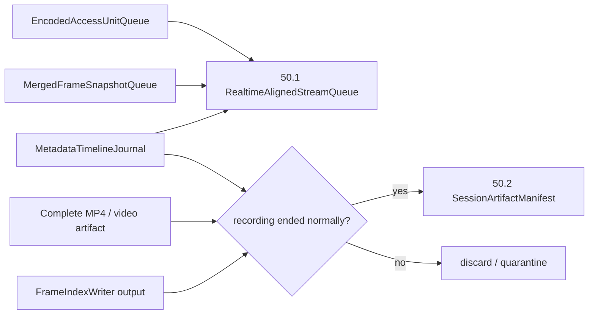
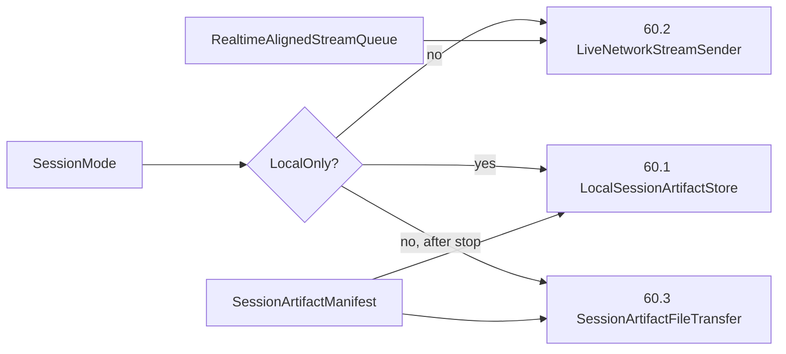

# 理想数据采集链路与当前链路问题

Last updated: 2026-06-12

## 核心结论

独立的 `40_FrameCommit` 层应该删除。`30_TimeSynchronization` 的输出顺序和输出 record 本身，就应该已经表达“哪个 texture / video input 对应哪一组 metadata”。

编码层可以慢，可以异步，但编码输入必须来自同步层输出的稳定 record，而不是来自会继续变化的 Current 状态：

```text
正确：
30_TimeSynchronization
  -> MergedFrameSnapshotRecord(frameId, sourceTimestamp, videoInputRef, metadata group)
  -> 40_SingleEncodeProduction consumes that exact record
  -> EncodedAccessUnitRecord(frameId, sourceTimestamp, encodedPts)

错误：
30_TimeSynchronization outputs metadata for frame 100
  -> encoder later reads CurrentVideoFrameInputSO
  -> CurrentVideoFrameInputSO has already become frame 103
  -> network/file gets metadata 100 + video 103
```

因此理想主链路应是：

```text
00_SessionControl
  -> 10_CurrentSOInputs
  -> 20_QueueBuffers
  -> 30_TimeSynchronization
  -> 40_SingleEncodeProduction
  -> 50_ProductAssembly
  -> 60_Distribution
```

最终需要两类产物：

```text
实时产物：
  realtime video stream
  + realtime metadata sequence
  + frame identity / timing index

完整录制产物：
  complete MP4
  + complete metadata timeline
  + frame index / manifest
```

这两类产物必须来自同一组 `MergedFrameSnapshotRecord` 和同一次编码生产线。不能为了实时流和最终 MP4 各自重新渲染、重新编码。

Meta PCA 文档已核验：`PassthroughCameraAccess` 是 live camera texture + timestamp + intrinsics + pose 的来源，不是现成的视频编码流。来源：`https://developers.meta.com/horizon/llmstxt/documentation/unity/unity-pca-migration-from-webcamtexture.md`

当前实现状态必须明确分开：

```text
本地 MP4 编码 / 保存：
  已通。当前通过 InstantReplayLocalMp4Recorder 写本地 MP4，
  并能写 metadata sidecar / manifest。

网络实时视频编码：
  未通。Android MediaCodec 的 pattern + muxer 路径证明了编码器和 MP4 muxer 可用，
  但真实 Unity/PCA/composite texture -> MediaCodec input Surface -> access units
  还没有完成，因此不能宣称真实 H264/H265 视频流已经能发。
```

## 状态条件应该放在哪里

这些状态不属于同一个“门控层”。它们应该分布在对应阶段：

| 状态 / 条件 | 所属阶段 | 作用 | 不满足时 |
|---|---|---|---|
| 是否本地模式 | `00_SessionControl` | 决定是否需要 PC handshake、是否启用实时网络分发 | 不应影响采集链路本身，只影响启动前置条件和 `60_Distribution` 策略 |
| 联网握手是否正常 | `00_SessionControl` | 仅在非本地模式下影响能否开始 Recording | 阻止开始录制，提示 handshake blocker |
| 是否正在录制 | `00_SessionControl` 的状态，影响 `20_QueueBuffers` | `ShouldWriteQueues` 控制 Current 是否写入 Queue | 不写队列，不进入有效采集窗口 |
| 同步层队列是否同步 | `30_TimeSynchronization` | 决定能否产出 sendable `MergedFrameSnapshotRecord` | 当前帧不进入编码 |
| 编码是否正确 | `40_SingleEncodeProduction` | 决定实时流是否可发、完整视频是否可用 | 标记 session 有编码异常，阻止最终 artifact 正常发布 |
| 刚才录制结束是否正常 | `50_ProductAssembly` | 决定是否输出完整 MP4 + metadata timeline + frame index | 正常则发布 artifact；异常则丢弃或 quarantine，不发送正式结果 |

所以：`1/2/3` 在 `00` 阶段，因为它们影响流程是否开始；`4/5/6` 是后续阶段自己的 SO 字段和判断条件，分别影响同步、编码、最终产物发布。

## 理想分层

建议把 `DataCapture_Runtime` 整理为：

```text
00_SessionControl
  00.1_ModeSelection
    sessionMode: LocalOnly / NetworkOrHybrid
  00.2_NetworkHandshakeIfNeeded
    PCReceiverConnectionStatusSO
  00.3_RecordingState
    RecordingSessionStateSO
  00.4_StartStopControl
    RecordingSessionController

10_CurrentSOInputs
  PassthroughCameraFrameWriter
  ControllerPoseCapture
  ControllerButtonCapture
  HeadsetPoseCapture
  VirtualLayerFrameWriter
  CoordinateCalibrationController

20_QueueBuffers
  CurrentToQueueRecorders
  CameraImageQueue
  CameraFrameTimingQueue
  CameraPoseQueue
  CameraMetadataQueue
  CameraStreamStateQueue
  ControllerPoseQueue
  VirtualLayerFrameQueue

30_TimeSynchronization
  30.1_AlignmentConfiguration
  30.2_TimestampMerger
  30.3_MergedFrameSnapshotQueue
  30.4_MetadataTimelineJournal
  30.5_SynchronizationHealthState

40_SingleEncodeProduction
  40.1_SynchronizedFrameReader
  40.2_SingleRenderTextureBuilder
  40.3_TextureToAccessUnitEncoder
  40.4_EncodedAccessUnitQueue
  40.5_Mp4MuxerOrVideoArtifactWriter
  40.6_FrameIndexWriter
  40.7_EncodingHealthState

50_ProductAssembly
  50.1_RealtimeAlignedStreamQueue
  50.2_SessionArtifactManifest
  50.3_SessionFinalizeState

60_Distribution
  60.1_LocalSessionArtifactStore
  60.2_LiveNetworkStreamSender
  60.3_SessionArtifactFileTransfer

90_DebugAndTests
  DebugJpegProbe
  SmokeTests
  LegacyTests
```

命名重点：

- `30` 已经负责确定 texture / video input 对应哪组 metadata。
- `40` 不是第二次同步，也不是“commit 层”；它是单次编码生产线。
- `40.1_SynchronizedFrameReader` 只能读 `MergedFrameSnapshotQueue` 的稳定 record，不能读 `CurrentVideoFrameInputSO`。
- `40.2_SingleRenderTextureBuilder` 只在需要 raw/virtual/composite 转成编码纹理时工作，但必须继承 `MergedFrameSnapshotRecord.frameId/sourceTimestamp`。
- `50` 只组装实时产物和完整录制产物。
- `60` 只分发，不允许触发第二次渲染或编码。

## 理想详细流程图



关键约束：

- `30.3_MergedFrameSnapshotQueue` 的 record 就是同步后的稳定帧输入契约。
- 编码层不能读 `CurrentVideoFrameInputSO` 这种会继续变化的 Current 状态。
- 编码延迟不是问题；只要 `EncodedAccessUnitRecord` 继承同一个 `frameId/sourceTimestamp`，后面仍然能对齐。
- `40.2_SingleRenderTextureBuilder` 和 `40.3_TextureToAccessUnitEncoder` 是唯一画面/编码入口。
- `50.1_RealtimeAlignedStreamQueue` 和 `50.2_SessionArtifactManifest` 都从同一组 `Snapshot / MetaJournal / AU / Mp4 / Index` 产物生成。
- `60_Distribution` 只决定发到哪里，不允许回头触发第二套渲染或第二套编码。

## 按阶段解释

### 00 Session Control

`00` 只负责决定 session 能不能开始，以及以什么模式开始：

```text
LocalOnly
  不需要 PC handshake
  可以开始本地采集
  不启用 live network stream

NetworkOrHybrid
  需要 PC handshake 正常
  录制中启用 live network stream
  录制结束后发送完整 artifact
```

这里包含状态 `1/2/3`：

```text
1. 是否本地模式
2. 如果是联网模式，联网握手是否正常
3. 是否正在录制状态
```

这些状态影响的是“流程是否开始”和“Queue 是否写入”，不应该被画成覆盖所有阶段的独立门控层。

**理想流程图**



**当前代码 / 入口**

- `Assets/SObasic/Runtime/CurrentQueueBridge/RecordingSessionController.cs`
- `Assets/SObasic/Runtime/CurrentQueueBridge/RecordingSessionStateSO.cs`
- `Assets/DataCapture/Runtime/00_SessionControl/ModeSelection/SessionModeController.cs`
- `Assets/DataCapture/Runtime/00_SessionControl/RoutePolicy/OutputRouteGateController.cs`
- `Assets/SObasic/Runtime/ScriptableObjects/DataCapture/00_SessionControl/OutputRouteGateSO.cs`
- `Assets/SObasic/Runtime/ScriptableObjects/DataCapture/00_SessionControl/PCReceiverConnectionStatusSO.cs`
- `Assets/SObasic/Runtime/ScriptableObjects/DataCapture/60_Distribution/NetworkSenderConfigurationSO.cs`

**当前 SO 资源**

- `Assets/SOData/DataCapture/00_SessionControl/RecordingSessionState.asset`
- `Assets/SOData/DataCapture/00_SessionControl/RecordingToggleRequest.asset`
- `Assets/SOData/DataCapture/60_Distribution/NetworkSenderConfiguration.asset`
- `Assets/SOData/DataCapture/00_SessionControl/OutputRouteGate.asset`
- `Assets/SOData/DataCapture/00_SessionControl/PCReceiverConnectionStatus.asset`
- `Assets/SOData/DataCapture/00_SessionControl/PCDiscoveryRequest.asset`

**当前差距 / 错误**

- 本地/网络模式现在由 `00_ModeSelection` 上的 `SessionModeController` 显式暴露，当前默认是 `LocalOnly / LocalFile`。
- `OutputRouteGateSO` 已位于 `00_SessionControl` 资源目录，并记录 `sessionMode`、`outputTarget`、是否需要网络握手、以及 `canStartRecording`。
- `CaptureTransmissionGateSO` 容易被误解成启动门控；它更像后续发送/编码健康诊断，不应该决定本地采集能不能开始。
- `OutputRouteGate.asset` 已刷新为 `Local output route skips network handshake.`，本地模式下不会停在未评估状态。

### 10 Current SO Inputs

所有采集源只负责写当前值：

```text
PCA camera -> CurrentCamera*
controller -> CurrentController*
headset -> CurrentHeadset*
virtual layer -> CurrentVirtualLayerFrame
```

虚拟图层也是正式采集源，不是同步后的旁路。

**理想流程图**



**当前代码 / 入口**

- `Assets/DataCapture/CameraCapture/PassthroughCamera/PassthroughCameraFrameWriter.cs`
- `Assets/DataCapture/Runtime/10_CurrentSOInputs/Controller/ControllerPoseCapture.cs`
- `Assets/DataCapture/Runtime/10_CurrentSOInputs/Headset/HeadsetPoseCapture.cs`
- `Assets/DataCapture/CameraCapture/VirtualLayer/VirtualLayerFrameWriter.cs`
- `Assets/DataCapture/Coordinate system calibration/CoordinateCalibrationController.cs`

**当前 SO 资源**

- `Assets/SOData/DataCapture/10_CurrentSOInputs/PassthroughCamera/CurrentCameraMetadata.asset`
- `Assets/SOData/DataCapture/10_CurrentSOInputs/Controller/CurrentControllerPose.asset`
- `Assets/SOData/DataCapture/10_CurrentSOInputs/Headset/CurrentHeadsetPose.asset`
- `Assets/SOData/DataCapture/10_CurrentSOInputs/VirtualLayer/CurrentVirtualLayerFrame.asset`

**当前差距 / 错误**

- 虚拟图层已有 Current SO，但文档和同步配置没有明确把它作为正式 stream 推进后续阶段。
- 当前编码相关组件容易直接消费 `CurrentVideoFrameInputSO` 或 compositor 输出，这会绕过 `Current -> Queue -> Sync` 的正式采集语义。

### 20 Queue Buffers

`RecordingSessionStateSO.ShouldWriteQueues` 控制 Current 是否写入 Queue：

```text
ShouldWriteQueues == true
  CurrentToQueueRecorder writes queues

ShouldWriteQueues == false
  Current may update, but capture queue should not grow
```

**理想流程图**



**当前代码 / 入口**

- `Assets/SObasic/Runtime/CurrentQueueBridge/CurrentToQueueRecorder.cs`
- `Assets/SObasic/Runtime/CurrentQueueBridge/IRecordQueueSink.cs`
- `Assets/SObasic/Runtime/CurrentQueueBridge/ICurrentRecordSource.cs`
- `Assets/DataCapture/Diagnostics/QueueDebug/QueueDebugReporter.cs`

**当前 SO 资源**

- `Assets/SOData/DataCapture/20_QueueBuffers/PassthroughCamera/CameraImageQueue.asset`
- `Assets/SOData/DataCapture/20_QueueBuffers/PassthroughCamera/CameraFrameTimingQueue.asset`
- `Assets/SOData/DataCapture/20_QueueBuffers/PassthroughCamera/CameraPoseQueue.asset`
- `Assets/SOData/DataCapture/20_QueueBuffers/PassthroughCamera/CameraMetadataQueue.asset`
- `Assets/SOData/DataCapture/20_QueueBuffers/PassthroughCamera/CameraStreamStateQueue.asset`
- `Assets/SOData/DataCapture/20_QueueBuffers/Controller/ControllerPoseQueue.asset`
- `Assets/SOData/DataCapture/20_QueueBuffers/Headset/HeadsetPoseQueue.asset`
- `Assets/SOData/DataCapture/20_QueueBuffers/VirtualLayer/VirtualLayerQueue.asset`
- `Assets/SOData/DataCapture/90_DebugAndTests/QueueDebug_Camera.asset`
- `Assets/SOData/DataCapture/90_DebugAndTests/QueueDebug_Controller.asset`
- `Assets/SOData/DataCapture/90_DebugAndTests/QueueDebug_Headset.asset`
- `Assets/SOData/DataCapture/90_DebugAndTests/QueueDebug_VirtualLayer.asset`

**当前差距 / 错误**

- Queue 写入由 `ShouldWriteQueues` 控制是合理的，但停止录制/预热完成时清队列会破坏调试证据。
- 虚拟图层 Queue 存在，但没有被理想同步链路清楚接住。

### 30 Time Synchronization

同步层只判断队列之间能否对齐，并输出稳定的 `MergedFrameSnapshotRecord`。这里对应状态 `4`：

```text
4. 同步层队列是否同步
```

如果当前队列无法形成 sendable snapshot，就不应该进入编码。

**理想流程图**



**当前代码 / 入口**

- `Assets/DataCapture/Runtime/30_TimeSynchronization/Sync/TimestampMerger.cs`
- `Assets/SObasic/Runtime/ScriptableObjects/DataCapture/30_TimeSynchronization/MergedFrameSnapshotQueueSO.cs`
- `Assets/SObasic/Runtime/ScriptableObjects/DataCapture/90_DebugAndTests/TimestampMergerDebugStateSO.cs`
- `Assets/SObasic/Runtime/ScriptableObjects/DataCapture/90_DebugAndTests/QueueDebugStateSO.cs`

**当前 SO 资源**

- `Assets/SOData/DataCapture/30_TimeSynchronization/CompositeAlignmentConfiguration.asset`
- `Assets/SOData/DataCapture/30_TimeSynchronization/MergedFrameSnapshotQueue.asset`
- `Assets/SOData/DataCapture/30_TimeSynchronization/TimestampMergerDebugState.asset`

**当前差距 / 错误**

- `CompositeAlignmentConfiguration.asset` 当前没有明确纳入 `VirtualLayerFrame` required/optional 关系。
- `MergedFrameSnapshotRecord` 需要被定义为编码层唯一输入契约：包含 frameId、sourceTimestamp、视频输入身份、metadata group。
- 同步健康目前会影响 `CaptureTransmissionGateSO.synthesisHealthy`，但这个状态应被理解为后续发送/编码健康，不是 00 启动门控。

### 40 Single Encode Production

编码层只接受 `MergedFrameSnapshotRecord`，并产出带同一身份的 encoded access unit。这里对应状态 `5`：

```text
5. 编码是否正确
```

如果编码失败，不能假装该帧可以实时发送，也不能把最终 session artifact 标记为正常。

编码延迟不是问题；编码输入来源错误才是问题。

这里的“一次编码”不是指只能产生一种输出，而是指只产生一条带时间身份的编码产物流：

```text
MergedFrameSnapshotRecord(frameId/sourceTimestamp/videoInputRef/metadata group)
  -> one render / texture input for this exact record
  -> one H264/H265 encoder
  -> one EncodedAccessUnitRecord sequence
       frameId
       sourceTimestamp
       presentationTimeUs / encodedPts
       codec config / key frame / sample bytes
```

然后所有下游都消费这同一批 access units：

```text
同一批 EncodedAccessUnitRecord
  -> realtime video packetizer
       + 同 frameId/sourceTimestamp 的 realtime metadata packet
       -> live network stream

  -> MP4 muxer / local video artifact writer
       + complete metadata timeline
       + frame index / manifest
       -> complete MP4 + metadata sequence
```

所以“能视频流，又能本地保存”的正确做法不是两套编码器，也不是实时流重新渲染一次、MP4 再重新录一次。正确做法是：

```text
1. 同步层吐出稳定 Snapshot。
2. 编码层只对这个 Snapshot 的画面输入编码一次。
3. 编码器 drain 出来的同一批 output samples：
   - 一份包装成实时网络视频包。
   - 同时写入 MediaMuxer / MP4 文件。
4. metadata timeline 和 frame index 记录：
   - 哪个 frameId/sourceTimestamp 对应哪个 access unit。
   - 哪个 metadata record 对应哪个 MP4 sample / 时间段。
```

这意味着 `40.4` 的中心不应该只是“某个当前编码帧”，而应该是 `Single Encode Access Unit Bus`：一条可被多个 sink 读取的、有帧身份和时间身份的编码产物序列。

**理想流程图**



这张图里 `Packetizer` 和 `Mp4Muxer` 是两个 sink，不是两个 encoder。它们的输入必须是同一个 `EncodedAccessUnitRecord` 序列。

**当前 Unity / Android 编码手法**

当前项目里有两条需要分清的编码事实：

1. 本地 MP4 已经可行。

   当前可工作的本地路径是 `InstantReplayLocalMp4Recorder`：

   ```text
   CurrentVideoFrameInputSO.inputTexture
     -> ManualTextureFrameProvider
     -> InstantReplay / UniEnc UnboundedRecordingSession
     -> Android 本地 MP4
     -> metadata sidecar / manifest
     -> EncodedOutputMetadataBinder 发布 file artifact
   ```

   这条链路证明 Unity/PCA texture 可以在 Android 上写成本地 MP4。它当前是可用原型，但不是最终架构，因为它仍然围绕 `CurrentVideoFrameInputSO` 推帧；理想上必须改成读取 `MergedFrameSnapshotRecord` 对应的稳定画面输入。

2. Android MediaCodec 单编码总线方向已证明一部分，但真实 Unity texture 网络编码还没通。

   当前 Java 侧 `Q3SurfaceVideoEncoder` 的手法是：

   ```text
   Unity C#
     -> AndroidJavaObject("com.q3datacapture.mediacodec.Q3SurfaceVideoEncoder")
     -> startWithMp4(...)
          MediaCodec.createEncoderByType(video/avc or video/hevc)
          MediaCodec.configure(... COLOR_FormatSurface ...)
          MediaCodec.createInputSurface()
          optional MediaMuxer
          nativeAttachEncoderSurface(inputSurface, width, height)

     -> encodePatternFrame(...)
          EGL synthetic pattern draw into input Surface
          drain MediaCodec output buffers
          return byte[] access unit to C#
          write same sample to MediaMuxer
   ```

   这条 smoke 证明了一个关键点：同一批 `MediaCodec` output samples 可以同时返回给 Unity/C# 做实时流，也可以写入 `MediaMuxer` 形成 MP4。也就是说“一次编码，多路输出”的 Android 技术方向是成立的。

   但它目前编码的是 Java synthetic pattern，不是真实 Unity/PCA texture。真实纹理入口 `encodeUnityTextureFrame(...)` 当前仍是占位实现，会返回空 access unit。Unity `RenderTexture / VkImage -> Vulkan native bridge -> MediaCodec input Surface` 的像素写入还没有完成。

**当前硬约束**

- 本地编码 / 本地 MP4：已通，当前通过 `InstantReplayLocalMp4Recorder` 可用。
- 网络实时视频编码：没通。现有网络链路不能被描述成已经能发送真实 H264/H265 PCA/Unity 视频流。
- Android `MediaCodec + MediaMuxer`：synthetic pattern 已证明可输出 access units 并同时 mux MP4，但还没有证明真实 Unity/PCA/composite texture 进入 MediaCodec。
- 最终不能保留“本地 MP4 一套、网络实时流一套”的双编码结构。最终必须收敛到同一条 `EncodedAccessUnitRecord` 序列。
- 在真实 texture bridge 未完成前，不能把 Java pattern MP4 当成真实摄像头编码结果，也不能把 InstantReplay 原型当成最终 single encode bus。

**当前代码 / 入口**

- `Assets/DataCapture/Runtime/40_SingleEncodeProduction/SynchronizedFrameReader/VideoFrameInputResolver.cs`
- `Assets/DataCapture/Runtime/40_SingleEncodeProduction/SynchronizedFrameReader/VideoEncodingParameterResolver.cs`
- `Assets/SObasic/Runtime/ScriptableObjects/DataCapture/40_SingleEncodeProduction/EncoderConfigurationSO.cs`
- `Assets/SObasic/Runtime/ScriptableObjects/DataCapture/40_SingleEncodeProduction/EncodingPipelineConfigurationSO.cs`
- `Assets/SObasic/Runtime/ScriptableObjects/DataCapture/40_SingleEncodeProduction/EncodedFrameQueueSO.cs`
- `Assets/DataCapture/Runtime/40_SingleEncodeProduction/EncoderBackends/InstantReplayLocalPrototype/InstantReplayLocalMp4Recorder.cs`
- `Assets/DataCapture/Runtime/40_SingleEncodeProduction/EncoderBackends/AndroidMediaCodec/README.zh-CN.md`
- `Assets/DataCapture/Runtime/40_SingleEncodeProduction/EncoderBackends/AndroidMediaCodec/UnityDynamicTextureEncoderSmokeRunner.cs`
- `Assets/DataCapture/Runtime/40_SingleEncodeProduction/EncoderBackends/AndroidMediaCodec/SingleEncodeAndroidMuxerSmokeRunner.cs`
- `Assets/Plugins/Android/com/q3datacapture/mediacodec/Q3SurfaceVideoEncoder.java`
- `Assets/DataCapture/Legacy/EncodingNetwork/RuntimeState/EncodedFrameQueueWriter.cs`
- `Assets/DataCapture/Legacy/EncodingNetwork/RealtimeStreamSend/VideoStreamEncoderRunner.cs`
- `Assets/DataCapture/Runtime/90_DebugAndTests/Probes/DebugLowFpsImage/AsyncDebugJpegNetworkStreamer.cs`

**当前 SO 资源**

- `Assets/SOData/DataCapture/40_SingleEncodeProduction/Transition/CurrentVideoFrameInput.asset`
- `Assets/SOData/DataCapture/40_SingleEncodeProduction/Transition/VideoFrameInputConfiguration.asset`
- `Assets/SOData/DataCapture/40_SingleEncodeProduction/EncoderConfiguration.asset`
- `Assets/SOData/DataCapture/40_SingleEncodeProduction/EncodingPipelineConfiguration.asset`
- `Assets/SOData/DataCapture/40_SingleEncodeProduction/CurrentEncodedFrame.asset`
- `Assets/SOData/DataCapture/40_SingleEncodeProduction/EncodedFrameQueue.asset`
- `Assets/SOData/DataCapture/90_DebugAndTests/DebugImageStreamSettings.asset`

**当前差距 / 错误**

- 当前编码层仍容易围绕 `CurrentVideoFrameInputSO` 工作；这正是会造成延迟错位的风险点。
- `EncodedFrameQueue` 不足以表达最终所需的 `EncodedAccessUnitRecord(frameId/sourceTimestamp/presentationTimeUs/encodedPts/sampleBytes)`。
- `InstantReplayLocalMp4Recorder` 当前本地 MP4 可用，但它是本地原型 sink，不是最终可复用的单次编码生产线。
- Android `Q3SurfaceVideoEncoder` 的 pattern + muxer 路径证明了 MediaCodec/MediaMuxer 管线，但 `encodeUnityTextureFrame(...)` 仍未把真实 Unity/PCA texture 写入 encoder surface。
- 网络实时 H264/H265 视频编码和发送还没通，不能和本地 MP4 已通混为一谈。
- Debug JPEG 仍混在编码叙事里，应降级为 `90_DebugAndTests/DebugJpegProbe`。
- `EncodingPipelineConfiguration.asset` 和 `EncoderConfiguration.asset` 存在目标冲突：一个指向 H264/LocalMp4，一个仍是 DEBUG_JPEG/低帧率配置。

### 50 Product Assembly

`50` 组装两类产物：

```text
RealtimeAlignedStreamQueue
  encoded video packet
  + metadata packet
  + frameId/sourceTimestamp/encodedPts

SessionArtifactManifest
  complete MP4
  + complete metadata timeline
  + frame index
```

这里对应状态 `6`：

```text
6. 刚才的录制结束是否正常
```

只有录制结束正常、编码正常、metadata timeline 和 MP4/frame index 都完整，才发布 `SessionArtifactManifest`。否则应该丢弃或 quarantine，不应该作为正式数据发送。

**理想流程图**



**当前代码 / 入口**

- 当前没有明确的 `RealtimeAlignedStreamQueue`、`SessionArtifactManifest`、`MetadataTimelineJournal`、`FrameIndexWriter` 正式实现。
- 当前接近但不等价的入口包括：
  - `Assets/DataCapture/Runtime/50_ProductAssembly/SessionArtifacts/EncodedOutputMetadataBinder.cs`
  - `Assets/SObasic/Runtime/ScriptableObjects/DataCapture/50_ProductAssembly/CaptureOutputQueueSO.cs`
  - `Assets/DataCapture/Runtime/50_ProductAssembly/SessionArtifacts/CaptureOutputRecord.cs`
  - `Assets/SObasic/Runtime/ScriptableObjects/DataCapture/60_Distribution/CaptureOutputConsumerStateSO.cs`

**当前 SO 资源**

- `Assets/SOData/DataCapture/50_ProductAssembly/CaptureOutputQueue.asset`
- `Assets/SOData/DataCapture/50_ProductAssembly/CurrentCaptureOutput.asset`
- `Assets/SOData/DataCapture/50_ProductAssembly/EncodedOutputBindingConfiguration.asset`
- `Assets/SOData/DataCapture/60_Distribution/LocalFileArtifactConsumerState.asset`
- `Assets/SOData/DataCapture/60_Distribution/NetworkFramePacketConsumerState.asset`
- `Assets/SOData/DataCapture/60_Distribution/NetworkFileArtifactConsumerState.asset`

**当前差距 / 错误**

- `CaptureOutputQueue` 过宽，不能同时准确表达实时对齐包和完整 session artifact。
- 缺少完整 metadata timeline 文件产物。
- 缺少 frame index / manifest，录制结束后无法可靠说明 MP4 sample 和 metadata record 的映射。

### 60 Distribution

`60` 只做分发策略：

```text
LocalOnly
  -> 60.1_LocalSessionArtifactStore

NetworkOrHybrid during recording
  -> 60.2_LiveNetworkStreamSender

NetworkOrHybrid after stop
  -> 60.3_SessionArtifactFileTransfer
```

`60` 不能反向触发新的渲染或编码。

**理想流程图**



**当前代码 / 入口**

- `Assets/DataCapture/Runtime/60_Distribution/LiveNetworkStream/NetworkTransmissionCoordinator.cs`
- `Assets/DataCapture/Runtime/60_Distribution/LiveNetworkStream/MetadataPacketSender.cs`
- `Assets/DataCapture/Runtime/60_Distribution/LiveNetworkStream/VideoPacketSender.cs`
- `Assets/DataCapture/Runtime/60_Distribution/Transports/UdpPacketTransport.cs`
- `Assets/DataCapture/Runtime/60_Distribution/Packets/MergedMetadataPacket.cs`
- `Assets/DataCapture/Runtime/60_Distribution/Packets/EncodedVideoPacket.cs`

**当前 SO 资源**

- `Assets/SOData/DataCapture/60_Distribution/CurrentNetworkPacket.asset`
- `Assets/SOData/DataCapture/60_Distribution/NetworkPacketQueue.asset`
- `Assets/SOData/DataCapture/60_Distribution/CaptureTransmissionGate.asset`

**当前差距 / 错误**

- 当前网络主链路仍偏向 `NetworkTransmissionCoordinator -> MetadataPacketSender`，没有统一消费实时对齐视频+metadata 包。
- 结束后完整 artifact file transfer 的路线还没有和 `SessionArtifactManifest` 概念对齐。
- `LocalOnly` 应不需要 PC handshake，也不应启用 live network sender，但当前配置分散在网络 SO 下，Inspector 不直观。

## 当前门控和 SO 问题

当前相关 SO：

```text
NetworkSenderConfigurationSO
  outputTarget = RemoteReceiver / SelfReceiver / LocalFile / RemoteAndLocalFile / SelfAndLocalFile
  UsesNetwork 决定是否需要 PC handshake。
  UsesLocalFile 决定是否有本地文件输出。

PCReceiverConnectionStatusSO
  phase / handshakeSucceeded / pcConnected / portsPaired / remoteHost / metadataPort / videoPort
  CanStartRecording == handshakeSucceeded

OutputRouteGateSO
  requiresNetworkHandshake / networkHandshakeSatisfied / canStartRecording / activeBlocker
  LocalFile 路线理论上应跳过 network handshake。

RecordingSessionStateSO
  NotStarted / WarmingUp / Recording
  ShouldWriteQueues == WarmingUp 或 Recording

CaptureTransmissionGateSO
  outputRouteReady + recordingActive + synthesisHealthy => canEncodeAndSend

TimestampMergerDebugStateSO + QueueDebugStateSO[]
  latestIsSendable 和 required queue health 会影响 CaptureTransmissionGateSO.synthesisHealthy。
```

当前问题是：这些 SO 已经包含很多有价值的状态，但它们没有被组织成清晰的阶段语义。尤其是 `CaptureTransmissionGateSO` 更像发送/编码健康诊断，不应该被理解成 00 阶段的启动门控。

## 当前主要问题

1. `10 -> 20 -> 30` 主采集链路本身是清楚的，但后半段把合成、编码、本地 MP4、网络发送、Debug JPEG 混在一起。
2. `30_TimeSynchronization` 的输出应被定义成编码层唯一输入契约，而不是再经过一个意义不明的 FrameCommit 层。
3. 编码层当前容易从 `CurrentVideoFrameInputSO` 读取，这会在编码延迟时造成 metadata/video 错位。
4. 编码层产物没有被定义成时间对齐流。只说 `EncodedFrameQueue` 不够，必须有 `EncodedAccessUnitRecord(frameId/sourceTimestamp/encodedPts)`。
5. `CaptureOutputQueue` 命名和职责过宽。实时对齐流、完整视频文件、完整 metadata timeline、frame index 不是同一种东西。
6. 当前缺少“单次渲染、单次编码、多产物分发”的明确约束，容易走成实时一套、录制一套。
7. `PassthroughCameraLayerCompositor` 被当成入口会误导。如果它直接消费当前帧或 RenderTexture，它就绕过了同步层；它只能作为 `40.2_SingleRenderTextureBuilder` 的实现细节。
8. 本地/网络模式开关藏在 SO asset 中，不在第一阶段显式呈现。用户看 Hierarchy 时无法马上判断当前是本地录制、网络发送，还是混合输出。
9. 当前 `EncodingPipelineConfiguration.asset` 指向 `LocalMp4Save + VideoOnly + AndroidMediaCodecH264`，但 `EncoderConfiguration.asset` 仍写 `DEBUG_JPEG / 2 FPS / 320x320`，目标和参数冲突。
10. 本地 MP4 当前已通，但它走的是 `InstantReplayLocalMp4Recorder` 原型路径，不是最终 single encode access unit bus。
11. 网络实时 H264/H265 视频编码当前没通。`Q3SurfaceVideoEncoder.encodePatternFrame(...)` 只证明 Java synthetic pattern 能进入 MediaCodec/MediaMuxer；`encodeUnityTextureFrame(...)` 仍未输出真实 Unity/PCA texture access units。

## 判断标准

重排后，站在场景 Hierarchy 上应该能回答：

1. 当前 session 是 `LocalOnly` 还是 `NetworkOrHybrid`？
2. 如果是联网模式，PC handshake 是否正常？
3. 当前是否正在 Recording，`ShouldWriteQueues` 是否为 true？
4. 当前有哪些 stream 会进入 Current SO？
5. 每个 Current SO 是否都有对应 Queue？
6. 同步层是否已经得到 sendable `MergedFrameSnapshotRecord`？
7. 编码层是否只从 `MergedFrameSnapshotQueue` 读稳定 record？
8. 编码层是否完全避免读取会变化的 `CurrentVideoFrameInputSO`？
9. 编码是否正确，失败时会不会阻止实时发送和最终 artifact 发布？
10. 录制结束是否正常，是否应该发布完整 MP4 + metadata timeline + frame index？
11. `60_Distribution` 是否只做分发，而不会触发第二次渲染或编码？
12. 本地 MP4 已通和网络实时视频未通这两个状态，是否在 Inspector / 阶段状态 SO 中被明确区分？
13. `MediaCodec` 输出给实时流和 MP4 的是否是同一批 access units，而不是两条独立编码路径？

如果这些问题不能从 Inspector 第一屏、阶段状态 SO、层级名直接回答，说明层级还没有整理干净。
