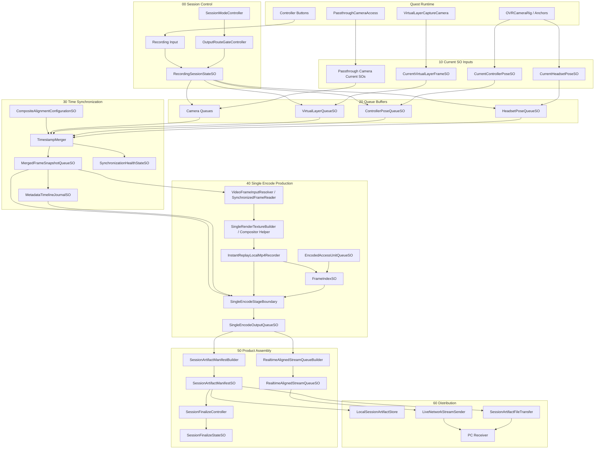
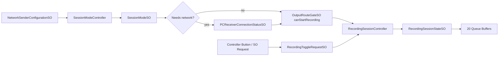
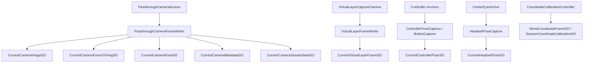
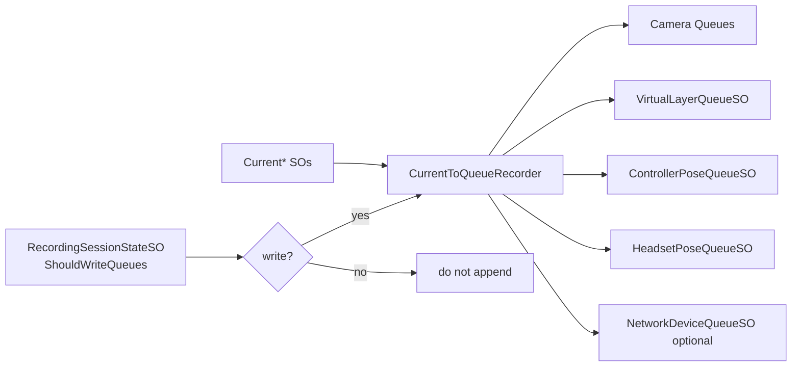
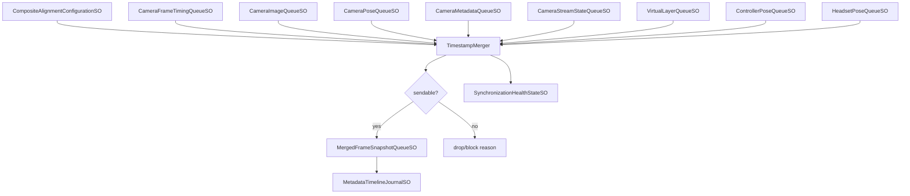
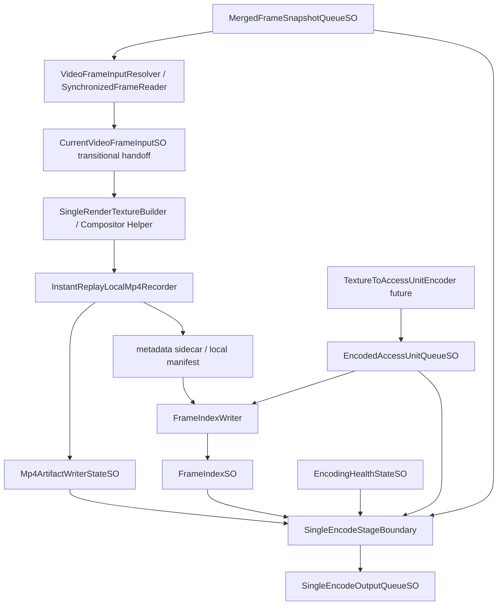
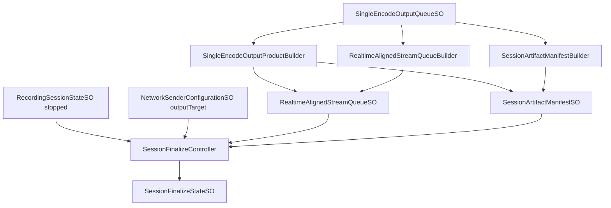
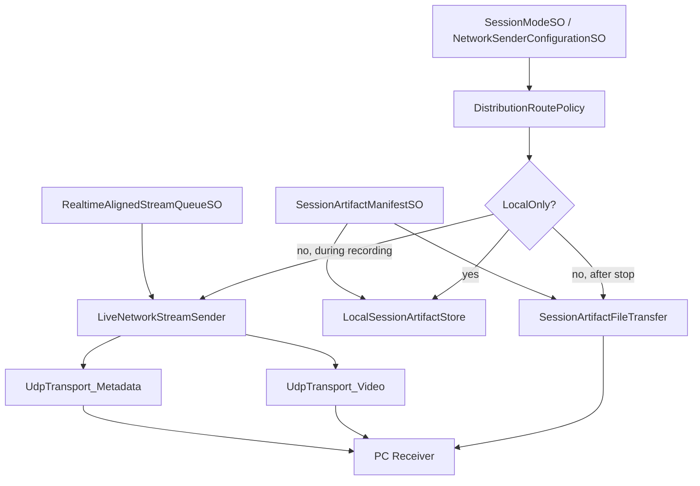
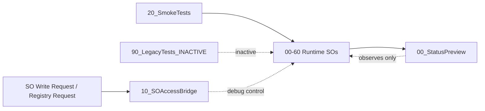

# Q3 Data Collection 项目介绍

Last updated: 2026-06-13

## 1. 项目定义：收集什么数据，如何收集

`Q3_data_collection` 是一个面向 Meta Quest / Horizon OS 的 Unity 数据采集项目。它的目标是在 Quest 运行时采集 passthrough camera 画面、虚拟图层、控制器姿态、头显姿态、相机参数、时间戳和录制/输出状态，并把这些数据整理成可实时发送、可本地保存、可离线复盘的 session 产物。

Meta 官方文档已核验：Unity 的 `PassthroughCameraAccess` 提供的是 live camera texture 和相机相关数据入口，不是现成的 H264/H265 编码流。因此本项目需要自己完成同步、编码、索引、manifest 和分发。

项目的数据总线使用 ScriptableObject：

```text
Current* SO
  保存最新一帧/最新状态

*Queue SO
  保存录制窗口内的时间序列

*State / *HealthState SO
  保存运行状态、门控结果、失败原因

*Configuration SO
  保存录制前配置

*Request SO
  保存一次性控制请求
```

当前主场景是：

```text
Assets/Scenes/SampleScene.unity
```

主运行根节点是：

```text
DataCapture_Runtime
```

外部 Meta / Unity building blocks 保持在场景根部：

```text
[BuildingBlock] Camera Rig
[BuildingBlock] Passthrough
[BuildingBlock] Passthrough Camera Access
DataCapture_Runtime
```

`DataCapture_Runtime` 现在按阶段组织为：

```text
00_SessionControl
10_CurrentSOInputs
20_QueueBuffers
30_TimeSynchronization
40_SingleEncodeProduction
50_ProductAssembly
60_Distribution
90_DebugAndTests
```

当前“01 到 05”的小规模重整可以理解为：从采集输入、队列、同步、单次编码生产，到产物组装已经建立了较清晰的分层骨架，并补入了 `SessionModeController`、virtual layer 正式 Current/Queue、`MergedFrameSnapshotQueueSO` 作为 04 输入、`SingleEncodeStageBoundary` 作为 04 出口、以及 05 的 product builders / finalize controller。

## 2. 关键约束

### 数据身份约束

所有进入编码和最终产物的数据必须能追溯到同一个同步帧身份：

```text
frameId
sourceTimestamp
video input reference
metadata group
```

理想上，这个身份由 `30_TimeSynchronization` 输出的 `MergedFrameSnapshotRecord` 固定。后续阶段不应该临时读取一个还会变化的 `Current*` 资产来决定“这帧视频对应哪组 metadata”。

### Current 只表示最新状态

`Current*` SO 只能表示“当前最新值”，不表示稳定输入契约。编码层可以在过渡期通过 `CurrentVideoFrameInputSO` 接收解析后的 texture handoff，但正式外部契约必须来自 `MergedFrameSnapshotQueueSO`。

### Queue 才是录制窗口

`20_QueueBuffers` 只在 `RecordingSessionStateSO.ShouldWriteQueues` 为 true 时把 Current 写入 Queue。Current 可以一直更新，但只有进入 Queue 的记录才属于录制窗口。

### 同步层决定能否进入编码

`30_TimeSynchronization` 负责 required/optional stream 的时间对齐。它输出 sendable snapshot，或者输出明确的 drop/block reason。编码层不再重新判断各输入是否属于同一帧。

### 单次编码约束

理想最终状态是单次编码、多路消费：

```text
one synchronized frame
  -> one render / texture input
  -> one H264/H265 access-unit sequence
  -> realtime stream sink
  -> MP4 muxer sink
```

实时流和本地 MP4 不应由两套独立编码路径分别生成。当前 InstantReplay local MP4 是可用的 bootstrap path，不等于最终 access-unit bus。

### 04 对外只有阶段出口

`40_SingleEncodeProduction` 的公共出口是 `SingleEncodeOutputQueueSO`。`50_ProductAssembly` 应优先消费这个出口，而不是直接读取 04 内部的 `EncodedAccessUnitQueueSO`、`Mp4ArtifactWriterStateSO`、`FrameIndexSO` 等细节。

### 60 只做分发

`60_Distribution` 只能消费 `50_ProductAssembly` 的产物。它不应该回头触发新的渲染、编码或同步。

### 调试不能变成生产链路

`90_DebugAndTests` 可以观察、触发、验证，但不能成为生产链路必经节点。Debug JPEG、smoke runner、SO debug probe 都只代表调试能力，不代表正式数据链路已经完成。

## 3. 总处理流程图



## 4. 每层工作职责和流程图

### 00 Session Control

职责：

- 决定当前 session 是 `LocalOnly` 还是 `NetworkOrHybrid`。
- 决定是否需要 PC handshake。
- 监听录制按钮或调试请求。
- 控制 `RecordingSessionStateSO` 的生命周期。
- 给下游提供 `ShouldWriteQueues`。

主要对象：

- `00_ModeSelection`: `SessionModeController`
- `10_NetworkHandshakeIfNeeded`: `LanDiscoveryClient`
- `20_RecordingInput`: `ControllerButtonRecordingToggleListener`
- `30_RecordingState`: `RecordingSessionController`
- `40_OutputRouteGate`: `OutputRouteGateController`

流程：



### 10 Current SO Inputs

职责：

- 从 Quest runtime 和 Unity scene 读取最新数据。
- 只写 `Current*` SO。
- 不直接写 Queue，不做同步，不做编码。

采集内容：

- Passthrough camera image / timing / pose / metadata / stream state。
- Virtual layer frame。
- Controller pose / buttons。
- Headset CenterEye pose。
- Coordinate calibration。
- Optional network device state。

流程：



### 20 Queue Buffers

职责：

- 把录制窗口内的 Current 采样写入时间序列 Queue。
- 以 `RecordingSessionStateSO.ShouldWriteQueues` 作为写入门控。
- 为同步层提供可查询的历史窗口。

主要队列：

- `CameraImageQueueSO`
- `CameraFrameTimingQueueSO`
- `CameraPoseQueueSO`
- `CameraMetadataQueueSO`
- `CameraStreamStateQueueSO`
- `VirtualLayerQueueSO`
- `ControllerPoseQueueSO`
- `HeadsetPoseQueueSO`
- `NetworkDeviceQueueSO`

流程：



### 30 Time Synchronization

职责：

- 读取 Queue 中的时间序列。
- 按 `CompositeAlignmentConfigurationSO` 判断 required/optional stream。
- 以 camera timing 为主要时间锚，产出 sendable `MergedFrameSnapshotRecord`。
- 写入 metadata timeline 和 synchronization health。

当前状态：

- `MergedFrameSnapshotQueueSO` 是 04 的正式输入契约。
- `VirtualLayerQueueSO` 已被纳入 required stream。
- `MetadataTimelineJournalWriter` 和 `SynchronizationHealthReporter` 已存在，场景中对应节点用于承载它们。

流程：



### 40 Single Encode Production

职责：

- 只从 30 的同步 snapshot 读取正式输入。
- 为同步帧解析或构建视频 texture 输入。
- 通过 bootstrap path 写本地 MP4。
- 最终目标是输出 H264/H265 `EncodedAccessUnitRecord` 序列。
- 维护 frame index、encoding health、MP4 artifact state。
- 通过 `SingleEncodeStageBoundary` 发布 04 的统一外部输出。

当前状态：

- `VideoFrameInputResolver` 已绑定 `MergedFrameSnapshotQueue.asset`，legacy current fallback 关闭。
- `InstantReplayLocalMp4Recorder` 是当前 local MP4 bootstrap path，只在 Android Player / Quest 上运行。
- `FrameIndexWriter` 已挂载，可从 access units 或 InstantReplay metadata sidecar 生成 `FrameIndex.asset`。
- `SingleEncodeHealthReporter` 已挂载。
- `SingleEncodeStageBoundary` 已挂载，输出 `SingleEncodeOutputQueue.asset`。
- `20_TextureToAccessUnitEncoder` 仍是空节点，真实 Unity/PCA texture -> MediaCodec access unit bus 尚未完成。

流程：



### 50 Product Assembly

职责：

- 消费 04 的 `SingleEncodeOutputQueueSO`。
- 生成实时对齐流产物。
- 生成完整 session artifact manifest。
- 录制结束后判断产物应该 publish、discard 还是 quarantine。

当前状态：

- `RealtimeAlignedStreamQueueBuilder` 已挂载。
- `SessionArtifactManifestBuilder` 已挂载。
- `SessionFinalizeController` 已挂载。
- `SingleEncodeOutputProductBuilder` 是从 `SingleEncodeOutputQueueSO` 到 05 产物的兼容/适配桥。
- `CaptureOutputQueue.asset` 是 legacy/compatibility output，不应作为新架构主出口。

流程：



### 60 Distribution

职责：

- 按 session mode 和 output target 分发 50 的产物。
- 本地模式保存完整 artifact。
- 网络/混合模式发送 realtime stream，并在停止后传输完整 artifact。
- 不回头读 Current/Queue，不触发新的渲染或编码。

当前状态：

- `MetadataPacketSender`、`VideoPacketSender`、`NetworkTransmissionCoordinator`、UDP transports 已存在。
- `RoutePolicy`、`LocalSessionArtifactStore`、`SessionArtifactFileTransfer` 仍需要进一步正式化。
- 实时 H264/H265 access units 尚未从 40/50 推通到 PC receiver。

流程：



### 90 Debug And Tests

职责：

- 展示 Queue、同步、编码、分发状态。
- 提供 SO access bridge。
- 承载 smoke tests 和 legacy inactive tests。
- 不参与生产链路必经路径。

当前重要调试入口：

- `SO_Debug_Probe`: 旧 SO debug route，验证 00/10/20/30 和临时 Debug JPEG 相关链路。
- `Local_MP4_New01_to_05_Debug_Run`: 当前从 10 到 05 的 local MP4 end-to-end diagnostic，`runOnStart = false`。

流程：



## 当前阅读顺序

新 agent 接手项目时建议按这个顺序读：

1. `q3-data-collection-project-introduction.zh-CN.md`
2. `scenes/sample-scene.md`
3. `assets/data-capture-scriptable-objects.md`
4. `systems/stage-04-single-encode-production.md`
5. `current-vs-ideal-data-capture-gaps.zh-CN.md`
