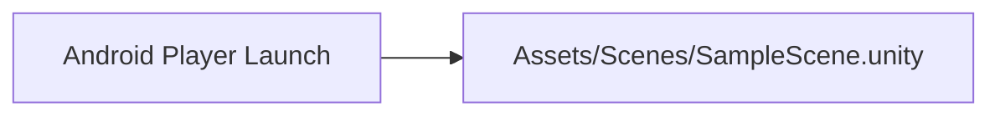
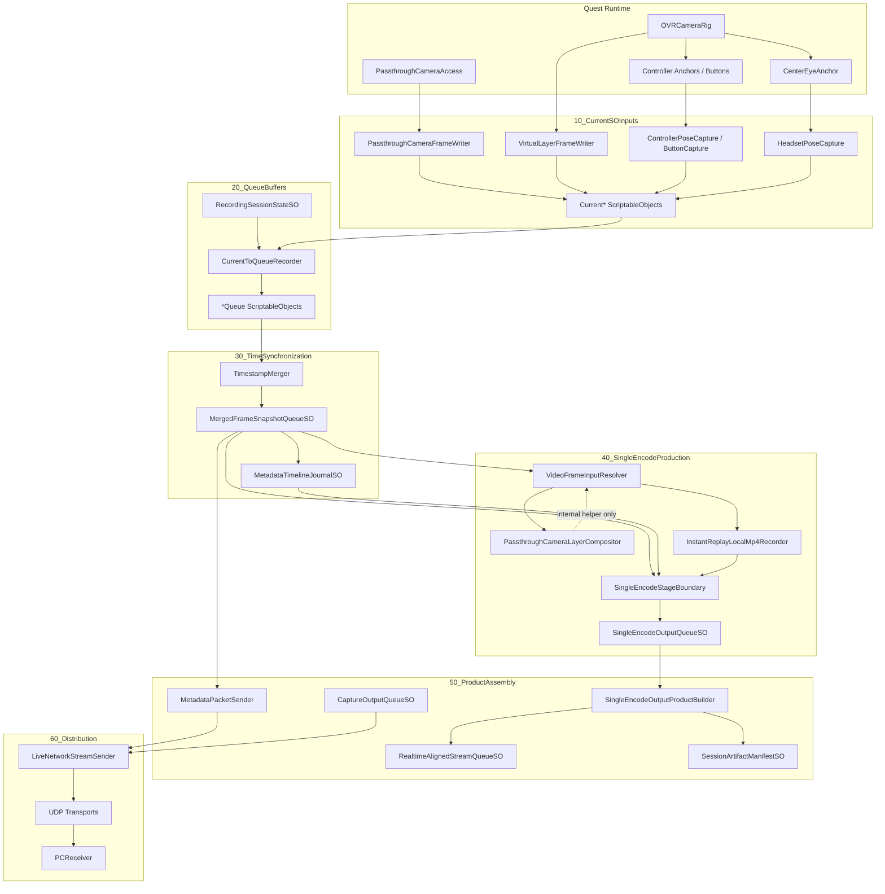

# Scene And Data Flow

Last updated: 2026-06-12

## Build Scene Flow

Only `SampleScene.unity` is enabled in `ProjectSettings/EditorBuildSettings.asset`.

Other scenes found in `Assets/Scenes`:

- `SingleEncodePcSmoke.unity`: smoke/prototype scene for single-encode and bridge validation. Not in Build Settings.
- `New Scene.unity`: not in Build Settings.

## Main Data Flow

