# SampleScene

Last updated: 2026-06-13

## Role

`Assets/Scenes/SampleScene.unity` is the only enabled build scene and is the main runtime scene for Quest data capture.

## Root Objects

- `[BuildingBlock] Camera Rig`: Meta camera rig with `OVRCameraRig`, `OVRManager`, controller anchors, hand/controller tracking objects, and `CenterEyeAnchor`.
- `[BuildingBlock] Passthrough`: OVR passthrough layer.
- `[BuildingBlock] Passthrough Camera Access`: Meta `PassthroughCameraAccess` source. Scene configuration requests `1280x960` at 30 FPS.
- `DataCapture_Runtime`: all project-specific capture, synchronization, encoding, transport, and debug wiring.

## DataCapture_Runtime Layout

```text
DataCapture_Runtime
  00_SessionControl
    00_ModeSelection
    10_NetworkHandshakeIfNeeded
    20_RecordingInput
    30_RecordingState
    40_OutputRouteGate

  10_CurrentSOInputs
    00_PassthroughCamera_CurrentWriter
    10_VirtualLayer_CurrentWriter
      VirtualLayerCaptureCamera
    20_Controller_CurrentWriter
    30_Headset_CurrentWriter
    40_CoordinateCalibration
    50_NetworkDevice_CurrentWriter_OPTIONAL

  20_QueueBuffers
    00_PassthroughCamera_Queues
    10_VirtualLayer_Queue
    20_Controller_Queue
    30_Headset_Queue
    40_NetworkDevice_Queue_OPTIONAL (inactive)

  30_TimeSynchronization
    00_TimestampMerger
    10_MetadataTimelineJournal
    20_SynchronizationHealth
    90_MergedSnapshotJsonExporter_DEBUG

  40_SingleEncodeProduction
    00_SynchronizedFrameReader
    10_SingleRenderTextureBuilder
    20_TextureToAccessUnitEncoder
    30_Mp4MuxerOrVideoArtifactWriter
    40_FrameIndexWriter
    50_EncodingHealth
    60_StageBoundary

  50_ProductAssembly
    00_RealtimeAlignedStreamQueueBuilder
    10_SessionArtifactManifestBuilder
    20_SessionFinalizeController
    30_SingleEncodeOutputProductBuilder

  60_Distribution
    00_RoutePolicy
    10_LocalSessionArtifactStore
    20_LiveNetworkStreamSender
      MetadataPacketSender
      VideoPacketSender
      NetworkTransmissionCoordinator
    30_SessionArtifactFileTransfer
    40_Transports
      UdpTransport_Metadata
      UdpTransport_Video

  90_DebugAndTests
    00_StatusPreview
    10_SOAccessBridge
    20_SmokeTests
    90_LegacyTests_INACTIVE (inactive)
```

## Runtime Flow

```mermaid
flowchart LR
    PCA[PassthroughCameraAccess] --> CamWriter[00_PassthroughCamera_CurrentWriter]
    VirtualCam[VirtualLayerCaptureCamera] --> VirtualWriter[10_VirtualLayer_CurrentWriter]
    Rig[Camera Rig Anchors] --> PoseWriters[Headset/Controller Current Writers]
    CamWriter --> Current[Current SOs]
    VirtualWriter --> Current
    PoseWriters --> Current
    Current --> Recorders[CurrentToQueueRecorder]
    RecState[RecordingSessionState] --> Recorders
    Recorders --> Queues[Queue SOs]
    Queues --> Merger[TimestampMerger]
    Merger --> Merged[MergedFrameSnapshotQueue]
    Merged --> Metadata[MetadataPacketSender]
    Metadata --> UDP[UDP metadata]
    Merged --> VideoInput[00_SynchronizedFrameReader]
    VideoInput --> Builder[10_SingleRenderTextureBuilder]
    Builder --> LocalMp4[30_Mp4MuxerOrVideoArtifactWriter]
    Merged --> Boundary[60_StageBoundary]
    LocalMp4 --> Boundary
    Boundary --> Product[50_ProductAssembly]
    Product --> Distribution[60_Distribution]
```



## Current Notable Settings

- `LanDiscoveryClient.discoverOnStart = false`.
- `RecordingButton_SOListener.recordingButton = LeftSecondaryButton`.
- `00_ModeSelection` has `SessionModeController` bound to `SessionMode.asset` and `NetworkSenderConfiguration.asset`; current default is `LocalOnly / LocalFile`.
- `OutputRouteGateController` reads `SessionMode.asset`, `NetworkSenderConfiguration.asset`, and `PCReceiverConnectionStatus.asset` to decide whether network handshake is required.
- `RecordingSessionController.clearQueuesWhenRecordingStarts = true`.
- `RecordingSessionController.clearQueuesWhenRecordingStops = true`.
- `TimestampMerger.waitForRequiredStreamsBeforeOutput = true`.
- `TimestampMerger.suppressWarmupSnapshots = true`.
- `TimestampMerger.clearMergedQueueOnWarmupComplete = true`.
- `TimestampMerger.clearInputQueuesOnWarmupComplete = true`.
- `10_VirtualLayer_CurrentWriter.writeOnUpdate = true`; it is the stage-01 producer for `CurrentVirtualLayerFrame.asset`.
- `10_VirtualLayer_Queue` records `CurrentVirtualLayerFrame.asset -> VirtualLayerQueue.asset`.
- `CompositeAlignmentConfiguration.asset` includes `VirtualLayerQueue.asset` as a required stream. `TimestampMerger` writes matched `VirtualLayerFrameRecord` data into `MergedFrameSnapshotQueueSO`.
- Stage 03's `MergedFrameSnapshotQueueSO` is the formal single input to stage 04.
- `40_SingleEncodeProduction/00_SynchronizedFrameReader` has `VideoFrameInputResolver` bound to `MergedFrameSnapshotQueue.asset` with legacy current fallback disabled. It blocks instead of reading mutable current SOs when no sendable synchronized frame exists.
- `40_SingleEncodeProduction/10_SingleRenderTextureBuilder` has `PassthroughCameraLayerCompositor` available as an internal render helper, but it no longer writes `CurrentVirtualLayerFrame.asset`; 04 is not the virtual-layer producer.
- Stage 04's public output is `SingleEncodeOutputQueueSO`; stage 05 should consume that output instead of reading stage-04 internals. The output now includes video artifact state, the full metadata timeline, and a resolved frame-index sequence.
- `40_SingleEncodeProduction/30_Mp4MuxerOrVideoArtifactWriter` has `InstantReplayLocalMp4Recorder` mounted. It follows `RecordingSessionState`, requires `EncodingPipelineConfiguration.outputMode = LocalMp4Save`, and has `androidPlayerOnly = true`, so it is expected to run on Android Player / Quest rather than in the Unity Editor.
- `InstantReplayLocalMp4Recorder` is bound to `Mp4ArtifactWriterState.asset`. It updates that state on start, finalization, and failure so stage 04/05 can distinguish a finalized local MP4 from missing or blocked artifacts.
- `40_SingleEncodeProduction/20_TextureToAccessUnitEncoder` is currently an empty node. `40_FrameIndexWriter` has `FrameIndexWriter` mounted and writes `FrameIndex.asset` from encoded access units when available, or from the InstantReplay local MP4 metadata sidecar after finalization. `50_EncodingHealth` has `SingleEncodeHealthReporter`, but the real access-unit encoder health path is still missing.
- The scene is enough to attempt a first local MP4 on Quest Android Player through the InstantReplay bootstrap path if PCA/current texture data is valid and recording enters `Recording`. It is not enough to prove the final Vulkan/MediaCodec access-unit path.
- Local MP4 still also publishes through the legacy `EncodedOutputMetadataBinder -> CaptureOutputQueue` path. Treat that as compatibility output; `Mp4ArtifactWriterState.asset` is the current bridge used by the new 04 stage boundary and 05 product manifest path.
- Legacy debug image encoding is under `90_DebugAndTests/90_LegacyTests_INACTIVE` and is inactive in the active scene.
- `SO_Debug_Probe.runOnStart = false`.
- `90_DebugAndTests/20_SmokeTests/Local_MP4_New01_to_05_Debug_Run` has `LocalMp4EndToEndDebugRunner` mounted with `runOnStart = false`. It is the current automatic diagnostic for the rebuilt local path from `10_CurrentSOInputs` through stage 05. It forces `LocalOnly / LocalFile / LocalMp4Save` during a run, opens the recording window through `RecordingToggleRequestSO`, checks current inputs, queues, synchronization, local MP4 writer state, and finally stage-05 manifest/finalize state. It does not bypass 05 requirements; missing metadata timeline or frame index should surface as a `LocalMp4E2E.05` blocker.

## Scene-Specific Risks

- Placeholder nodes exist for planned single-encode/product/distribution state writers and should be filled with components before runtime code depends on them.
- Legacy/inactive tests are isolated under `90_DebugAndTests/90_LegacyTests_INACTIVE`; keep them inactive unless explicitly validating old debug flows.
- Current settings favor local MP4 mode, while the PC receiver/network code remains present but not necessarily used for video.
- The current texture snapshot pools keep a short window of camera-image and virtual-layer RenderTextures stable for queue/sync/encode handoff. They are not a replacement for a long-duration frame cache if 04 falls far behind stage 01.
- See [Stage 04 Single Encode Production](../systems/stage-04-single-encode-production.md) for the precise current-vs-target encoding chain.
