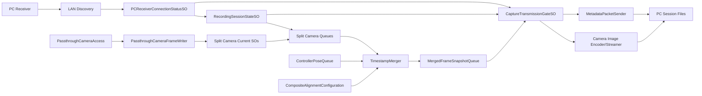

# DataCapture Full Runtime Chain

Last updated: 2026-06-10

## Purpose

This document summarizes the current Quest 3 data capture chain after splitting the passthrough camera data into separate ScriptableObject streams.

Official/local Quest reference checked on 2026-06-09:

- Meta docs search for Passthrough Camera Access.
- Local package source: `Library/PackageCache/com.meta.xr.mrutilitykit@f5cfbb0224ff/Core/Scripts/PassthroughCameraAccess.cs`.

## Runtime Flow



## Recording State

Primary files:

- `Assets/SObasic/Runtime/CurrentQueueBridge/RecordingSessionController.cs`
- `Assets/SObasic/Runtime/CurrentQueueBridge/RecordingSessionStateSO.cs`
- `Assets/SObasic/Runtime/CurrentQueueBridge/CurrentToQueueRecorder.cs`

`RecordingGateSO` has been removed. Queue writing is controlled only by `RecordingSessionStateSO.ShouldWriteQueues`.

State values:

- `NotStarted`: no queue writes.
- `WarmingUp`: queues may fill while merger waits for required streams.
- `Recording`: active capture/send window.

## Passthrough Camera Capture

Primary file:

- `Assets/DataCapture/CameraCapture/PassthroughCamera/PassthroughCameraFrameWriter.cs`

The writer reads a `[BuildingBlock] Passthrough Camera Access` component and writes five separate current SOs:

- `CurrentCameraImageSO`: texture reference, frame id, timestamp, image resolution.
- `CurrentCameraFrameTimingSO`: timestamp clock used as merge anchor.
- `CurrentCameraPoseSO`: pose from `PassthroughCameraAccess.GetCameraPose()`.
- `CurrentCameraMetadataSO`: intrinsics, lens offset, projection matrix, transform matrices, distortion placeholder.
- `CurrentCameraStreamStateSO`: camera eye, requested/current resolution, requested max FPS, measured FPS, support/play/update state, texture property.

Each current SO has a matching queue SO recorded by `CurrentToQueueRecorder`.

## Pose Capture

Controller pose remains a composite-alignment participant:

- `CurrentControllerPoseSO`
- `ControllerPoseQueueSO`

Headset pose still exists as a data stream, but it now stores only CenterEyeAnchor pose and is not configured for composite alignment by default:

- `CurrentHeadsetPoseSO`
- `HeadsetPoseQueueSO`

## Composite Alignment

Primary files:

- `Assets/DataCapture/Runtime/30_TimeSynchronization/Sync/TimestampMerger.cs`
- `Assets/SObasic/Runtime/ScriptableObjects/DataCapture/30_TimeSynchronization/CompositeAlignmentConfigurationSO.cs`
- `Assets/SOData/DataCapture/30_TimeSynchronization/CompositeAlignmentConfiguration.asset`

`CameraFrameTimingQueueSO` is the implicit anchor. `CompositeAlignmentConfiguration.asset` controls the addable SO sequence for matched streams.

Current configured participants:

- Camera image
- Camera pose
- Camera metadata
- Camera stream state
- Controller pose

Not configured for composite alignment:

- Virtual layer
- Headset pose
- Network-device data

## Encoding And Sending

Camera encoding uses `CurrentCameraImageSO` and `CameraImageFrameRecord`. Metadata packet generation serializes the split camera fields from `MergedFrameSnapshotRecord`.

Primary files:

- `Assets/DataCapture/Runtime/90_DebugAndTests/Probes/DebugLowFpsImage/Adapters/DebugJpegEncoderAdapter.cs`
- `Assets/DataCapture/Legacy/EncodingNetwork/RealtimeStreamSend/Adapters/AndroidMediaCodec/AndroidMediaCodecEncoderAdapter.cs`
- `Assets/DataCapture/Legacy/EncodingNetwork/RealtimeStreamSend/Adapters/WebRtc/WebRtcEncoderAdapter.cs`
- `Assets/DataCapture/Runtime/90_DebugAndTests/Probes/DebugLowFpsImage/AsyncDebugJpegNetworkStreamer.cs`
- `Assets/DataCapture/Runtime/60_Distribution/LiveNetworkStream/MetadataPacketSender.cs`
- `PCReceiver/q3dc_receiver.py`
- `PCReceiver/q3dc_receiver_gui.py`

## Debug Checklist

1. Confirm `PassthroughCameraAccess.IsPlaying`.
2. Check all five camera current SOs are valid.
3. Check all five camera queues are receiving records during warmup/recording.
4. Check `CompositeAlignmentConfiguration.asset` only lists intended alignment queues.
5. Check `TimestampMergerDebugState.latestMissingRequiredStreamMask`.
6. Check PC receiver receives metadata and image streams.

## Runtime Debug Design

Current SO debug-chain design is documented in `Assets/docs/10-so-debug-layer-design.md`.

The older per-test SO-driven runners are legacy-only:

- `Assets/DataCapture/Legacy/SoDrivenTests/SoDrivenTests/Runtime`
- `Assets/SObasic/Runtime/ScriptableObjects/DataCapture/90_DebugAndTests/Legacy/SoDrivenTests`
- `Assets/SOData/DataCapture/90_DebugAndTests/Legacy/SoDrivenTests`

The generic SO write bridge remains active in `Assets/DataCapture/Runtime/90_DebugAndTests/SOAccessAndPipeline`. In `SampleScene`, the old `SO_Driven_MergeLayer_Test` and `SO_Driven_EncodingSwitch_Test` GameObjects under `DataCapture_Runtime/90_AI_AutoDebug/Tests` are inactive.

Generic SO access infrastructure:

- `Assets/SObasic/Runtime/SOAccess/SOValueAccessUtility.cs`
- `Assets/DataCapture/Runtime/90_DebugAndTests/SOAccessAndPipeline/SOValueAccessController.cs`
- `Assets/DataCapture/Runtime/90_DebugAndTests/SOAccessAndPipeline/SORegistryListResponder.cs`
- `Assets/SObasic/Runtime/ScriptableObjects/DataCapture/90_DebugAndTests/SORegistryListRequestSO.cs`

`SOValueAccessController` supports editor/runtime function access to registered SOs. `SORegistryListResponder` lets ADB trigger a registry dump through `SORegistryListRequest.asset`; output is written back to the SO and logged with `[SO-Access][LIST]`.

SO debug layers mirror the scene chain under `Assets/DataCapture/Runtime/90_DebugAndTests/SOAccessAndPipeline`:

- `00_Handshake_RecordingControl/HandshakeRecordingControlDebugLayer.cs`
- `00_Handshake_RecordingControl/ControllerButtonDiscoveryRequestListener.cs`
- `10_CurrentSOInputs/CurrentSOInputsDebugLayer.cs`
- `20_QueueBuffers/QueueBuffersDebugLayer.cs`
- `30_Synchronization/SynchronizationDebugLayer.cs`
- `40_EncodingDecode/EncodingDecodeDebugLayer.cs`
- `50_NetworkSend/NetworkSendDebugLayer.cs`
- `60_PCReceiverEvidence/PCReceiverEvidenceDebugLayer.cs`
- `80_StatusPreview/StatusPreviewDebugNotes.cs`
- `90_IntegratedChain/DataCaptureSODebugPipeline.cs`

The active runtime debug chain uses production SO state instead of creating separate per-test SO state:

- `HandshakeRecordingControlDebugLayer` simulates controller-button SO input for discovery and recording, then reads `PCReceiverConnectionStatusSO`, `NetworkSenderConfigurationSO`, `RecordingToggleRequestSO`, and `RecordingSessionStateSO`.
- `CurrentSOInputsDebugLayer` reads required `Current*` SOs and checks validity, timestamp/sequence advancement, camera texture, stream support/play state, and controller pose.
- `QueueBuffersDebugLayer` reads required queue SOs and checks `Count`/`NewestTimestamp` growth while `RecordingSessionStateSO.ShouldWriteQueues` is true.
- `SynchronizationDebugLayer` reads `TimestampMergerDebugStateSO` and `MergedFrameSnapshotQueueSO`, checking `latestStatus == Complete`, `latestIsSendable == true`, no missing required streams, and state/queue advancement.
- `EncodingDecodeDebugLayer` is temporarily limited to low-frequency Debug JPEG only. It writes `EncodingPipelineConfigurationSO.pipelineMode = DebugImageOnly`, `videoEncoderBackend = DebugJpeg`, low-frequency `DebugImageStreamSettingsSO`, then waits for `CurrentEncodedFrameSO.codec == DEBUG_JPEG` and positive `byteLength`.
- `NetworkSendDebugLayer` is temporarily limited to the Debug JPEG packet path. It checks `CurrentNetworkPacketSO` / `NetworkPacketQueueSO` for a matching `video` stream header for the Debug JPEG frame.

PC receiver evidence and status preview remain reserved layer files. H264/H265/video-mode diagnostics are deliberately not active while the real video encoding layer is being rebuilt.

The central pipeline is deliberately thin. `90_IntegratedChain/DataCaptureSODebugPipeline.cs` starts after 1.5 seconds, normalizes any existing recording state, runs the implemented layers in order, stops at the first failed layer, and stops the recording window after 8 seconds. Layer-specific SO reads, SO writes, and Debug field construction stay in the layer files.

Implementation status:

- `90_IntegratedChain/DataCaptureSODebugPipeline.cs` orchestrates handshake, recording start/stop, Current SO capture, queue buffering, synchronization, temporary Debug JPEG encoding, and Debug JPEG packet verification.
- The component is mounted at `DataCapture_Runtime/90_AI_AutoDebug/Tests/SO_Debug_Probe` in `Assets/Scenes/SampleScene.unity`.
- It simulates controller-button SO input after a 1.5 second startup delay:
  `CurrentControllerPose.leftPrimaryButtonPressed` triggers PC discovery through `ControllerButtonDiscoveryRequestListener`, and
  `CurrentControllerPose.leftSecondaryButtonPressed` triggers recording start/stop through the existing `ControllerButtonRecordingToggleListener`.
  The recording window stays open for 8 seconds, then the same simulated recording button requests stop.
- `LanDiscoveryClient.discoverOnStart` is disabled in the scene so the debug pipeline owns the automatic handshake trigger.
- `EncodingPipelineConfiguration.asset` is currently set to `DebugImageOnly + DebugJpeg`; no video/H264/H265 option is exposed in the debug layer.

## New 01-to-05 Local MP4 Diagnostic Runner

`LocalMp4EndToEndDebugRunner.cs` is mounted at:

`DataCapture_Runtime/90_DebugAndTests/20_SmokeTests/Local_MP4_New01_to_05_Debug_Run`

It is intentionally separate from `DataCaptureSODebugPipeline`. Its purpose is to validate the rebuilt chain from `10_CurrentSOInputs` through stage 05 for local MP4 mode:

```text
RecordingToggleRequestSO opens the harness window
10_CurrentSOInputs/CurrentSOInputsDebugLayer
20_QueueBuffers/QueueBuffersDebugLayer
30_TimeSynchronization/SynchronizationDebugLayer
40_SingleEncodeProduction/InstantReplayLocalMp4Recorder
50_ProductAssembly/SessionArtifactManifestBuilder + SessionFinalizeController
```

The component has `runOnStart = false` by default. Enable it for a Quest Android Player smoke pass or invoke its context menu in Play Mode. During a run it forces `LocalOnly / LocalFile / LocalMp4Save / VideoOnly / AndroidMediaCodecH264`, waits for each stage, and logs `[SO-Debug][PASS]` or `[SO-Debug][FAIL]` with the first observed blocker.

This runner does not change the 05 finalize contract. If stage 04 produces an MP4 but stage 05 still requires an unfinished `FrameIndexSO` or `MetadataTimelineJournalSO`, the run should fail at `LocalMp4E2E.05` with the exact `SessionFinalizeStateSO` / `SessionArtifactManifestSO` failure fields.
