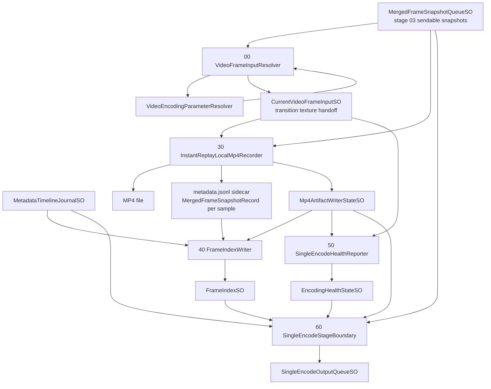
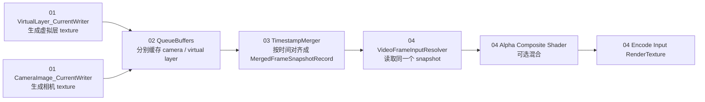
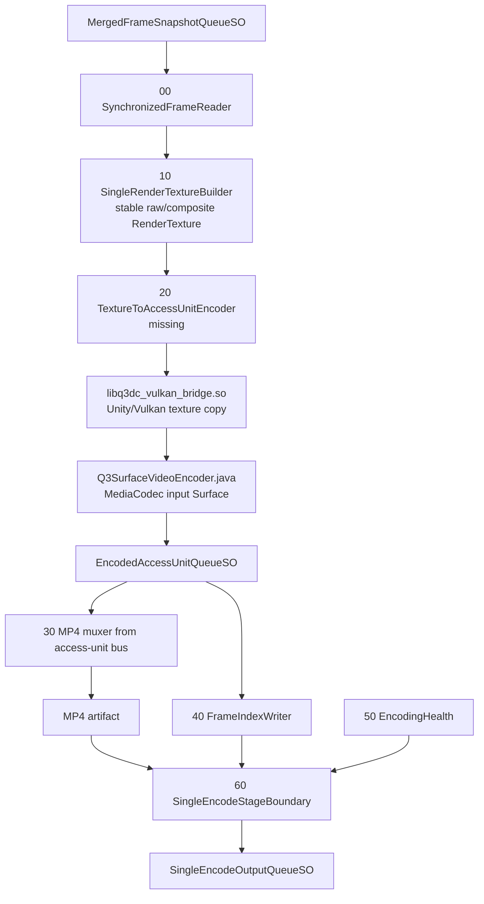

# Stage 04 Encoding Flow Analysis

Last updated: 2026-06-13

## 结论先行

Stage 04 的正式边界已经应该这样理解：

```text
输入：03 MergedFrameSnapshotQueueSO + 03 MetadataTimelineJournalSO
输出：04 SingleEncodeOutputQueueSO
内部：把 03 对齐后的画面纹理变成视频 artifact / access units / frame index
```

当前 `SampleScene` 里，04 已经有统一入口和统一出口，但真正的 `Texture -> H264/H265 EncodedAccessUnitQueueSO` 生产组件还缺失。现在可跑的是 `InstantReplayLocalMp4Recorder` 本地 MP4 bootstrap 路径，不是最终单编码流路径。

Meta Quest 验证点：Meta Passthrough Camera API 文档确认 Unity 可以拿到 live camera texture / GPU texture；编码、mux、frame index、stage-05 产品完整性由本项目实现，不是 PCA 自动提供。

## Scene Mounts

`Assets/Scenes/SampleScene.unity` 的 `DataCapture_Runtime/40_SingleEncodeProduction` 当前形态：

```text
40_SingleEncodeProduction
  00_SynchronizedFrameReader
    VideoFrameInputResolver

  10_SingleRenderTextureBuilder
    PassthroughCameraLayerCompositor

  20_TextureToAccessUnitEncoder
    empty node

  30_Mp4MuxerOrVideoArtifactWriter
    InstantReplayLocalMp4Recorder

  40_FrameIndexWriter
    FrameIndexWriter

  50_EncodingHealth
    SingleEncodeHealthReporter

  60_StageBoundary
    SingleEncodeStageBoundary
```

关键场景引用：

- `00_SynchronizedFrameReader.VideoFrameInputResolver.synchronizedFrameQueue = MergedFrameSnapshotQueue.asset`
- `00_SynchronizedFrameReader.VideoFrameInputResolver.allowLegacyCurrentFallback = false`
- `30_Mp4MuxerOrVideoArtifactWriter.InstantReplayLocalMp4Recorder.mergedSnapshotQueue = MergedFrameSnapshotQueue.asset`
- `40_FrameIndexWriter.FrameIndexWriter.metadataTimelineJournal = MetadataTimelineJournal.asset`
- `60_StageBoundary.SingleEncodeStageBoundary.outputQueue = SingleEncodeOutputQueue.asset`

## Current Runtime Flow

这张图是当前 `SampleScene` 实际能走通的 04 路径：



当前路径的本质：

- `VideoFrameInputResolver` 读 03 的 `MergedFrameSnapshotQueueSO.TryGetLatestSendable()`。
- 若配置是 raw，则拿 `snapshot.cameraImage.texture`。
- 若配置是 composite，则要求 `snapshot.cameraImage.texture` 和 `snapshot.virtualLayer.texture` 都存在，然后用 alpha shader 合成。
- 合成/拷贝后的纹理写到 `CurrentVideoFrameInputSO`。这个 SO 是 04 内部过渡手柄，不是 04 外部入口。
- `InstantReplayLocalMp4Recorder` 读取 `CurrentVideoFrameInputSO.inputTexture` 推给 InstantReplay/UniEnc，产出本地 MP4。
- `InstantReplayLocalMp4Recorder` 同时从 `MergedFrameSnapshotQueueSO` 找对应 snapshot，写 `.metadata.jsonl` sidecar。
- `FrameIndexWriter` 在没有 access-unit bus 时，从 `.metadata.jsonl` sidecar 重建 `FrameIndexSO`。
- `SingleEncodeStageBoundary` 汇总 MP4 state、metadata timeline、frame index，写 `SingleEncodeOutputQueueSO` 给 05。

## Virtual Layer / Camera Texture Mixing

04 不生产虚拟层。正确责任链是：



当前混合方式是普通 straight-alpha 覆盖：

```text
output.rgb = lerp(camera.rgb, virtualLayer.rgb, saturate(virtualLayer.a))
output.a   = lerp(camera.a,   virtualLayer.a,   saturate(virtualLayer.a))
```

代码位置：

- `VideoFrameInputResolver.ComposeSynchronizedFrame()` 负责把同一个 03 snapshot 里的 `cameraImage.texture` 和 `virtualLayer.texture` 交给 shader。
- `Assets/PassthroughLayerCompositor/PassthroughAlphaComposite.shader` 当前核心公式是 `lerp(passthrough, overlay, saturate(overlay.a))`。
- `10_SingleRenderTextureBuilder/PassthroughCameraLayerCompositor` 现在只是 04 内部的合成/拷贝辅助，不再向 01/02/03 发布虚拟层。

这说明目前“相机 texture + 虚拟层 texture”的合并是确定的，但它只是最基础的 alpha 合成。它没有做色彩空间校正、premultiplied-alpha 处理、深度遮挡、曝光匹配或边缘抗锯齿策略；如果虚拟层未来有半透明 UI、深度遮挡或真实世界光照一致性要求，这里需要升级成明确的混合策略。

## Code Path Map

### 1. 04 入口：VideoFrameInputResolver

文件：

- `Assets/DataCapture/Runtime/40_SingleEncodeProduction/SynchronizedFrameReader/VideoFrameInputResolver.cs`
- `Assets/DataCapture/Runtime/40_SingleEncodeProduction/SynchronizedFrameReader/VideoEncodingParameterResolver.cs`

主调用：

```text
Update()
  -> ResolveLatestFrame()
       -> TryGetSource()
            -> TryGetSynchronizedSource()
                 -> synchronizedFrameQueue.TryGetLatestSendable()
                 -> raw: snapshot.cameraImage.texture
                 -> composite: ComposeSynchronizedFrame(camera, virtualLayer)
       -> VideoEncodingParameterResolver.Resolve()
       -> optional staging RenderTexture blit
       -> CurrentVideoFrameInputSO.SetFrame()
```

重要行为：

- `allowLegacyCurrentFallback = false` 时，拿不到 03 sendable snapshot 就阻断。
- `updateOnlyForNewSourceFrame = true` 时，同一个 `sourceFrame.frameId` 不会重复发布。
- `CurrentVideoFrameInputSO` 携带：
  - `inputTexture`
  - `sourceKind`
  - `sourceCameraFrameId`
  - `timestampUnixMs`
  - `outputResolution`
  - `frameRate`
  - `bitrateKbps`
  - `codec`

当前 composite 方法：

```text
ComposeSynchronizedFrame()
  -> EnsureCompositeTexture()
  -> EnsureCompositeMaterial()
  -> material._OverlayTex = virtualLayerTexture
  -> Graphics.Blit(cameraTexture, compositeTexture, material)
```

shader：

- `Assets/PassthroughLayerCompositor/PassthroughAlphaComposite.shader`
- 当前公式：`lerp(passthrough, overlay, saturate(overlay.a))`

### 2. 参数解析：VideoEncodingParameterResolver

`VideoEncodingParameterResolver.Resolve()` 负责决定编码参数：

```text
EncoderConfigurationSO + EncodingPipelineConfigurationSO + CurrentCameraStreamStateSO
  -> ResolvedVideoEncodingParameters
```

关键规则：

- codec 优先来自 `EncodingPipelineConfigurationSO.videoEncoderBackend`
  - `AndroidMediaCodecH264 -> H264`
  - `AndroidMediaCodecH265 -> H265`
  - `DebugJpeg -> DEBUG_JPEG`
- resolution 默认来自 `EncoderConfigurationSO.targetWidth/targetHeight`
- 如果 `resolutionSource = CameraStreamState`，优先用 `CurrentCameraStreamStateSO.currentResolution`
- frame rate 同理，优先用 camera stream state 的 requested/measured framerate
- bitrate 可以 manual，也可以根据 resolution/fps/quality 估算
- 输出尺寸会强制至少 16 且为偶数

注意：这段仍读 current camera stream state，不是从 03 snapshot 读 stream state。它影响编码参数，不影响当前 04 的外部画面入口。

### 3. 本地 MP4 bootstrap：InstantReplayLocalMp4Recorder

文件：

- `Assets/DataCapture/Runtime/40_SingleEncodeProduction/EncoderBackends/InstantReplayLocalPrototype/InstantReplayLocalMp4Recorder.cs`

主调用：

```text
Update()
  -> FollowRecordingState()
       RecordingSessionStateSO.IsRecording
       && EncodingPipelineConfigurationSO.AllowsLocalMp4Save
       -> StartRecording()

  -> PushCurrentInputFrame()
       CurrentVideoFrameInputSO.inputTexture
       -> ManualTextureFrameProvider.Push()
       -> WriteMetadataSidecarLine()

StopRecording()
  -> session.CompleteAsync()
  -> WriteManifest()
  -> PublishFileArtifact()
  -> MarkMp4StateFinalized()
```

输出：

- `.mp4`
- `.metadata.jsonl`
- `.manifest.json`
- `Mp4ArtifactWriterStateSO`
- legacy `EncodedOutputMetadataBinder -> CaptureOutputQueueSO` file artifact

限制：

- `androidPlayerOnly = true`，Editor / non-Android 会明确 block。
- 这条路产出 MP4，但不产出 `EncodedAccessUnitQueueSO`。
- 它依赖 `CurrentVideoFrameInputSO` 作为内部纹理 handoff。

### 4. Frame index：FrameIndexWriter

文件：

- `Assets/DataCapture/Runtime/40_SingleEncodeProduction/FrameIndexing/FrameIndexWriter.cs`
- `Assets/SObasic/Runtime/ScriptableObjects/DataCapture/40_SingleEncodeProduction/FrameIndexSO.cs`

优先级：

```text
if EncodedAccessUnitQueueSO has records:
    access units + MetadataTimelineJournalSO -> FrameIndexSO
else if MP4 finalized and metadata sidecar exists:
    metadata.jsonl sidecar -> FrameIndexSO
```

access-unit 模式写入：

```text
FrameIndexEntry
  frameId
  sourceTimestampUnixMs
  accessUnitId
  encodedPtsUs
  mp4SampleIndex
  metadataTimelineEntryId
```

当前 bootstrap 模式：

- `accessUnitId = -1`
- `encodedPtsUs = sampleIndex`
- `mp4SampleIndex = sampleIndex`
- timestamp/frameId 从 sidecar 里的 `MergedFrameSnapshotRecord` 来

这能给 05 一个可检查的一一对应序列，但还不是 muxer/sample callback 级别的真实确认。

### 5. Health：SingleEncodeHealthReporter

文件：

- `Assets/DataCapture/Runtime/40_SingleEncodeProduction/Health/SingleEncodeHealthReporter.cs`
- `Assets/SObasic/Runtime/ScriptableObjects/DataCapture/40_SingleEncodeProduction/EncodingHealthStateSO.cs`

当前判断：

```text
CurrentVideoFrameInputSO valid?
  no -> blocker
  yes:
    if EncodedAccessUnitQueueSO.Count > 0:
        MarkAccessUnit()
    else if local MP4 is recording/finalized:
        mark bootstrap healthy enough
    else:
        blocker: no access units or local MP4 artifact
```

这不是最终 encoder health，只是当前 MP4 bootstrap 和未来 access-unit bus 的健康桥。

### 6. 04 出口：SingleEncodeStageBoundary

文件：

- `Assets/DataCapture/Runtime/40_SingleEncodeProduction/StageBoundary/SingleEncodeStageBoundary.cs`
- `Assets/SObasic/Runtime/ScriptableObjects/DataCapture/40_SingleEncodeProduction/SingleEncodeOutputQueueSO.cs`

主调用：

```text
Update()
  -> PublishIfReady()
       ValidateInputs()
       if publishOnlyFinalizedArtifacts && !mp4ArtifactWriterState.finalized:
           block
       BuildOutputRecord()
       outputQueue.RecordData()
```

汇总输入：

- `MergedFrameSnapshotQueueSO.ExportSendableSnapshot()`
- `MetadataTimelineJournalSO.ExportSnapshot()`
- `EncodedAccessUnitQueueSO.ExportSnapshot()`
- `Mp4ArtifactWriterStateSO`
- `FrameIndexSO`
- `EncodingHealthStateSO`

输出 `SingleEncodeOutputRecord` 包含：

- video artifact path / kind / byte length
- session id
- first/last frame id
- timestamp start/end
- frame count
- access unit count
- timestamp samples
- complete metadata timeline entries
- complete frame index entries
- failure reason

这是 05 最应该消费的 04 出口。

## Target Production Flow

目标链路应该长这样：



正式目标的关键要求：

- realtime stream 和 MP4 必须来自同一个 `EncodedAccessUnitQueueSO`。
- `TextureToAccessUnitEncoder` 必须把 04 的 RenderTexture 写入 Android `MediaCodec` input Surface。
- MP4 muxer 应消费同一批 access units，而不是另走 InstantReplay。
- `FrameIndexWriter` 应从 access units + metadata timeline 建立真实 mapping。
- health 应报告 encoder init、input texture、access unit、PTS、muxer failure。

## Android MediaCodec Backend State

已有代码：

- `Assets/Plugins/Android/com/q3datacapture/mediacodec/Q3SurfaceVideoEncoder.java`
- `Native/Q3VulkanBridge/q3dc_vulkan_bridge.cpp`
- `Assets/Plugins/Android/libs/arm64-v8a/libq3dc_vulkan_bridge.so`

当前能力：

- Java 可创建 `MediaCodec` encoder。
- 可使用 `COLOR_FormatSurface` input surface。
- 可 drain encoded bytes。
- 可用 `MediaMuxer` 写 MP4。
- native bridge 可 attach/detach encoder surface / native window。

当前缺口：

- 还没有正式 scene component 挂到 `20_TextureToAccessUnitEncoder`。
- Unity `RenderTexture` / Vulkan texture 到 encoder input Surface 的真正 copy/blit/render pass 仍未成为 production path。
- Java/Native smoke runners 存在，但不是 `SampleScene` 的主链路。

## Current Failure / Block Points

常见 blocker 来源：

```text
VideoFrameInputResolver
  - no sendable stage-03 snapshot
  - snapshot has no camera texture
  - composite mode missing virtual layer texture
  - encoding parameters invalid
  - duplicate frame id

InstantReplayLocalMp4Recorder
  - Android player required
  - outputMode is not LocalMp4Save
  - CurrentVideoFrameInputSO invalid
  - repeated frame id
  - InstantReplay exception

FrameIndexWriter
  - FrameIndexSO missing
  - MetadataTimelineJournalSO missing
  - no access units and no finalized MP4 sidecar

SingleEncodeStageBoundary
  - MP4 not finalized
  - no sendable synchronized frames
  - no metadata timeline
  - no frame index
  - no encoded access units and no usable MP4 artifact
```

## What To Fix Next

Recommended implementation order:

1. Fill `20_TextureToAccessUnitEncoder` with a real component that reads `CurrentVideoFrameInputSO` or a stricter internal `ResolvedEncodeFrame` and writes `EncodedAccessUnitQueueSO`.
2. Promote `SingleRenderTextureBuilder` from helper/compositor naming into a clear component that produces the exact `RenderTexture` for the selected 03 snapshot.
3. Wire `Q3SurfaceVideoEncoder` + `libq3dc_vulkan_bridge.so` into the scene path, not only smoke runners.
4. Replace InstantReplay MP4 bootstrap with an access-unit-bus MP4 muxer.
5. Make `FrameIndexWriter` rely on real access-unit IDs and muxer sample indices.
6. Keep `SingleEncodeStageBoundary` as the only public 04 -> 05 contract.
