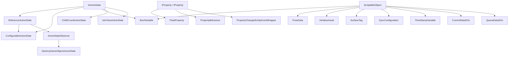

# SObasic SO 系统文档总览

> Last updated: 2026-06-09
> Scope: `Assets/SObasic` 当前源码，已重新整理旧 README 中的乱码和过期索引。
> Unity: `6000.3.6f1`

## 1. 系统定位

`SObasic` 是一套轻量的 Unity ScriptableObject + MonoBehaviour 状态组合系统。它把“状态判断”“状态组合”“属性变化通知”“SO 数据容器”“编辑器调试面板”拆成小而稳定的代码单元，让场景逻辑可以通过 Inspector 组合，而不是到处写硬编码引用。

这套系统适合：

- 用 `ScriptableObject` 保存可复用配置、布尔状态、位姿数据和数据采集同步缓存。
- 用 `IActiveState` 把不同来源的条件统一成 `Active`。
- 用 `ReferenceActiveState` 在 Inspector 中序列化接口引用，并支持反相、可选引用。
- 用 `ConfigurableActiveState` 把多个条件按 All / Any / ThisAndAll / ThisAndAny 组合。
- 用 `ActiveStateObserver` 监听状态变化后触发销毁、父级切换、刚体参数切换、UnityEvent 等行为。
- 用 `SOStateViewer` 在 Editor 里集中查看和调试 SO 数据。

核心优点是“低耦合、可组合、Inspector 友好”：状态提供者和状态消费者只依赖接口，不需要彼此知道具体类名。

## 2. 目录结构

```text
Assets/SObasic
├─ Runtime
│  ├─ Interfaces              # IActiveState / IProperty / ISelector 等抽象接口
│  ├─ Components              # 可挂到 GameObject 的状态、观察、条件行为组件
│  ├─ ScriptableObjects       # 可创建为资产的 SO 数据类型、同步缓存和辅助值对象
│  └─ SOStateViewer.cs        # DataCapture 调试总览组件
├─ Editor
│  └─ SOStateViewerEditor.cs  # SOStateViewer 的自定义 Inspector
└─ docs
   └─ README_DOCS.md          # 当前文档入口
```

## 3. 核心关系



## 4. 快速使用建议

1. 需要一个条件：写或挂一个实现 `IActiveState` 的组件 / SO。
2. 需要引用条件：字段使用 `ReferenceActiveState`，Inspector 里拖入实现了 `IActiveState` 的 MonoBehaviour。
3. 需要组合多个条件：挂 `ConfigurableActiveState`，在 `Compound States` 中配置多个 `ReferenceActiveState`。
4. 需要响应状态变化：继承 `ActiveStateObserver`，重写 `HandleActiveStateChanged()`。
5. 需要把属性变化转给 Inspector 事件：实现 `IProperty`，再挂 `PropertyChangedUnityEventWrapper`。
6. 需要调试 SO 数据：挂 `SOStateViewer`，用它的自定义 Inspector 查看按钮、位姿、相机和 Passthrough 状态。
7. 需要数据采集同步：使用 `SyncConfiguration` 配置采样/缓冲参数，用 `Current*SO` 暴露最新值，用 `*QueueSO` 保存可按时间查询的历史数据。

## 5. 逐代码说明

### Interfaces

| 文件                                                                                     | 作用                                                                       | 优点                                                                                    |
| ---------------------------------------------------------------------------------------- | -------------------------------------------------------------------------- | --------------------------------------------------------------------------------------- |
| [`Runtime/Interfaces/IActiveState.cs`](../Runtime/Interfaces/IActiveState.cs)             | 定义统一状态接口，只有 `bool Active { get; }`。                          | 极简抽象，任何组件或 SO 只要实现它，就能接入整套条件系统。                              |
| [`Runtime/Interfaces/IProperty.cs`](../Runtime/Interfaces/IProperty.cs)                   | 定义属性变化事件 `WhenChanged`，泛型版 `IProperty<T>` 增加 `Value`。 | 让属性容器和监听者解耦，UI、事件、同步逻辑都能只听变化事件。                            |
| [`Runtime/Interfaces/ISelector.cs`](../Runtime/Interfaces/ISelector.cs)                   | 定义选择器接口：选中、取消选中事件，以及 `GetSelectedValue()`。          | 给“多选项选择/当前选择值”预留统一接口，可和 `ReferenceSelector` 一起序列化引用。    |
| [`Runtime/Interfaces/InterfaceAttribute.cs`](../Runtime/Interfaces/InterfaceAttribute.cs) | 标记 Inspector 字段期望的接口类型。                                        | Unity 默认不能直接序列化接口字段，这个 Attribute 配合自定义 Drawer 能限制拖入对象类型。 |

### Active State Components

| 文件                                                                                                           | 作用                                                                                                                                              | 优点                                                                                          |
| -------------------------------------------------------------------------------------------------------------- | ------------------------------------------------------------------------------------------------------------------------------------------------- | --------------------------------------------------------------------------------------------- |
| [`Runtime/Components/ReferenceActiveState.cs`](../Runtime/Components/ReferenceActiveState.cs)                   | 可序列化的 `IActiveState` 引用包装。支持反相、可选空引用、隐式 bool 转换、Profiler 标记，并包含 `ReferenceSelector` 和 Editor Drawer。        | 解决 Unity Inspector 不能直接拖接口的问题；同一套字段可以引用任意状态提供者，减少硬编码依赖。 |
| [`Runtime/Components/ConfigurableActiveState.cs`](../Runtime/Components/ConfigurableActiveState.cs)             | 可配置的组合状态组件。支持自身布尔值、多个静态条件、运行时插入条件、All/Any/ThisAndAll/ThisAndAny 组合模式，以及最短激活时间 `_minActiveTime`。 | 可以在 Inspector 里搭出复杂条件，不必为每种组合新写脚本；最短激活时间能过滤抖动。             |
| [`Runtime/Components/ConfigurableActiveStateInsert.cs`](../Runtime/Components/ConfigurableActiveStateInsert.cs) | 在 `OnEnable` 时把一个状态动态插入到目标 `ConfigurableActiveState`，在 `OnDisable` 时移除。                                                 | 适合运行时生成或局部对象贡献条件，避免一个中心状态组件反向引用全场景对象。                    |
| [`Runtime/Components/ActiveStateObserver.cs`](../Runtime/Components/ActiveStateObserver.cs)                     | 抽象观察者基类，在 `Update` 或 `LateUpdate` 中检测 `ReferenceActiveState` 是否变化，并调用 `HandleActiveStateChanged()`。                 | 把轮询、初始绑定、Profiler 标记封装起来，派生类只写变化后的业务逻辑。                         |
| [`Runtime/Components/ActiveStateExpectation.cs`](../Runtime/Components/ActiveStateExpectation.cs)               | 提供 `True / False / Any` 期望枚举和 `Matches()` 扩展方法。                                                                                   | 让布尔条件匹配更可读，`Any` 可表达“不关心该条件”。                                        |
| [`Runtime/Components/ChildCountActiveState.cs`](../Runtime/Components/ChildCountActiveState.cs)                 | 根据当前 Transform 子物体数量是否落在 `FloatRanges` 范围内返回 Active。                                                                         | 不写代码即可用“子物体数量”作为条件，适合容器、插槽、收集物检测。                            |
| [`Runtime/Components/IsInViewActiveState.cs`](../Runtime/Components/IsInViewActiveState.cs)                     | 判断对象是否在 `Camera.main` 的视野内，支持半径、FOV 覆盖、最小/最大距离，并绘制 Gizmos。                                                       | 可把“是否被玩家看见”变成统一状态条件，调试时有可视化辅助。                                  |
| [`Runtime/Components/DestroyGameObjectActiveState.cs`](../Runtime/Components/DestroyGameObjectActiveState.cs)   | 继承 `ActiveStateObserver`，当观察到的状态变为 Active 时销毁当前 GameObject。                                                                   | 用配置即可完成“条件满足后销毁”，适合一次性触发物、临时对象、清理节点。                      |

### Conditional Behaviour Components

| 文件                                                                                                         | 作用                                                                                                          | 优点                                                                   |
| ------------------------------------------------------------------------------------------------------------ | ------------------------------------------------------------------------------------------------------------- | ---------------------------------------------------------------------- |
| [`Runtime/Components/ConditionalSetParent.cs`](../Runtime/Components/ConditionalSetParent.cs)                 | 根据一组条件选择父级 Transform，不满足任何条件时回到默认父级；支持运行时插入候选父级。                        | 让对象归属随状态变化自动切换，适合抓取、停靠、分组、状态机式层级管理。 |
| [`Runtime/Components/ConditionalRigidbodySettings.cs`](../Runtime/Components/ConditionalRigidbodySettings.cs) | 根据可选 `ReferenceActiveState` 自动设置 Rigidbody 的 `useGravity`、`isKinematic`、`freezeRotation`。 | 物理参数可被状态系统驱动，不需要多个脚本重复写刚体切换逻辑。           |

### Property Components

| 文件                                                                                                                 | 作用                                                                                  | 优点                                                                          |
| -------------------------------------------------------------------------------------------------------------------- | ------------------------------------------------------------------------------------- | ----------------------------------------------------------------------------- |
| [`Runtime/Components/PropertyBehaviour.cs`](../Runtime/Components/PropertyBehaviour.cs)                               | `IProperty` 和 `IProperty<T>` 的抽象基类，封装值变化去重和 `WhenChanged` 触发。 | 新增属性类型时只需继承泛型基类，变化通知逻辑保持一致。                        |
| [`Runtime/Components/FloatProperty.cs`](../Runtime/Components/FloatProperty.cs)                                       | 简单的 float 属性组件，实现 `IProperty<float>`。                                    | 可直接作为 Inspector 可见的 float 状态源，外部监听 `WhenChanged` 即可响应。 |
| [`Runtime/Components/PropertyChangedUnityEventWrapper.cs`](../Runtime/Components/PropertyChangedUnityEventWrapper.cs) | 监听同一 GameObject 上的 `IProperty.WhenChanged`，并转发到 `UnityEvent`。         | 非程序人员可以在 Inspector 中绑定变化事件，不需要写监听代码。                 |

### ScriptableObjects / Data Types

| 文件                                                                                                               | 作用                                                                       | 优点                                                                            |
| ------------------------------------------------------------------------------------------------------------------ | -------------------------------------------------------------------------- | ------------------------------------------------------------------------------- |
| [`Runtime/ScriptableObjects/Event/BoolVariable.cs`](../Runtime/ScriptableObjects/Event/BoolVariable.cs)             | 可创建为资产的 bool 变量，同时实现 `IActiveState`。                      | 一个 SO 就能既保存布尔状态，又作为条件输入接入观察者和组合状态。                |
| [`Runtime/ScriptableObjects/Pose/PoseData.cs`](../Runtime/ScriptableObjects/Pose/PoseData.cs)                       | 保存头显、左手柄、右手柄的 `Pose6DoF` 数据。                             | 把 VR 位姿数据集中到 SO 资产，便于采集、调试、跨组件共享。                      |
| [`Runtime/ScriptableObjects/Pose/Pose6DoF.cs`](../Runtime/ScriptableObjects/Pose/Pose6DoF.cs)                       | 可序列化的 6DoF 数据结构：位置、旋转、时间戳。                             | 数据结构清晰，适合记录 Quest/VR 输入设备的时序位姿。                            |
| [`Runtime/ScriptableObjects/Primitives/IntValueAsset.cs`](../Runtime/ScriptableObjects/Primitives/IntValueAsset.cs) | 保存一个 int 值的 ScriptableObject，并提供到 int 的隐式转换。              | 适合做关卡编号、检查点编号、配置索引等可共享整型资产。                          |
| [`Runtime/ScriptableObjects/Primitives/FloatRange.cs`](../Runtime/ScriptableObjects/Primitives/FloatRange.cs)       | 表示单个 float 范围，提供闭区间判断。                                      | 简单、可序列化，可被多个条件复用。                                              |
| [`Runtime/ScriptableObjects/Primitives/FloatRanges.cs`](../Runtime/ScriptableObjects/Primitives/FloatRanges.cs)     | 从字符串解析多个范围，例如 `"1-5, 8, 11-13"`，并判断值是否命中任意范围。 | 用一个 Inspector 字符串表达复杂范围，比数组配置更快、更紧凑。                   |
| [`Runtime/ScriptableObjects/Tags/SurfaceTag.cs`](../Runtime/ScriptableObjects/Tags/SurfaceTag.cs)                   | 空 ScriptableObject 标签，用资产身份代表表面类型。                         | 用资产引用做类型标识，比字符串稳定，不易拼写错误，也方便扩展表面音频/材质规则。 |

### DataCapture Synchronization SOs

这些文件虽然放在 `SObasic/Runtime/ScriptableObjects` 下，但命名空间是 `DataCapture.Synchronization`。它们属于当前 Q3 数据采集项目的同步数据层，依赖 `Assets/DataCapture/Synchronization/Runtime` 中的 `IDataSource<T>`、`RingBuffer<T>`、`ITimestampedData` 和各类 `*Record` 数据结构。

| 文件                                                                                                                                                                                           | 作用                                                                                                                           | 优点                                                                                    |
| ---------------------------------------------------------------------------------------------------------------------------------------------------------------------------------------------- | ------------------------------------------------------------------------------------------------------------------------------ | --------------------------------------------------------------------------------------- |
| [`Runtime/ScriptableObjects/DataCapture/Synchronization/Configuration/SyncConfiguration.cs`](../Runtime/ScriptableObjects/DataCapture/Synchronization/Configuration/SyncConfiguration.cs)       | 同步系统配置资产，保存缓冲容量、时间容差、各数据源采样率、输出采样率、重采样方式和数据源开关。                                 | 把同步参数集中成资产，便于不同采集场景复用配置，也方便在 Inspector 中调试采样策略。     |
| [`Runtime/ScriptableObjects/DataCapture/Synchronization/Configuration/TimeStampVariable.cs`](../Runtime/ScriptableObjects/DataCapture/Synchronization/Configuration/TimeStampVariable.cs)       | 保存当前 Unix 毫秒时间戳和服务启动后的 elapsed 秒数。                                                                          | 让数据源通过 SO 读取统一时间，不必直接依赖时间服务单例。                                |
| [`Runtime/ScriptableObjects/DataCapture/Synchronization/Current/CurrentCameraFrameSO.cs`](../Runtime/ScriptableObjects/DataCapture/Synchronization/Current/CurrentCameraFrameSO.cs)             | 保存当前相机帧纹理、帧 ID、时间戳、分辨率、相机姿态、内参、投影矩阵和坐标矩阵；可从/转回 `CameraFrameRecord`。               | 提供“最新相机帧”的共享入口，调试和其它系统可以直接读 SO，而不是访问采集组件内部状态。 |
| [`Runtime/ScriptableObjects/DataCapture/Synchronization/Current/CurrentControllerPoseSO.cs`](../Runtime/ScriptableObjects/DataCapture/Synchronization/Current/CurrentControllerPoseSO.cs)       | 保存左右手柄位置、旋转和按钮状态；可从/转回 `ControllerPoseRecord`。                                                         | 把手柄姿态与输入状态聚合在一个资产中，适合实时预览、同步合帧和日志记录。                |
| [`Runtime/ScriptableObjects/DataCapture/Synchronization/Current/CurrentHeadsetPoseSO.cs`](../Runtime/ScriptableObjects/DataCapture/Synchronization/Current/CurrentHeadsetPoseSO.cs)             | 保存当前头显位置、旋转、时间戳和有效性；可从/转回 `HeadsetPoseRecord`。                                                      | 作为头显最新姿态的轻量共享缓存，读取成本低，引用关系简单。                              |
| [`Runtime/ScriptableObjects/DataCapture/Synchronization/Current/CurrentNetworkDeviceSO.cs`](../Runtime/ScriptableObjects/DataCapture/Synchronization/Current/CurrentNetworkDeviceSO.cs)         | 保存外部网络设备数据，包括设备 ID、JSON payload、设备时间、接收时间、时钟偏移和统一时间戳；可从/转回 `NetworkDeviceRecord`。 | 适合接入外部传感器或网络设备，把异步输入转换成可同步的时间戳数据。                      |
| [`Runtime/ScriptableObjects/DataCapture/Synchronization/Current/CurrentVirtualLayerFrameSO.cs`](../Runtime/ScriptableObjects/DataCapture/Synchronization/Current/CurrentVirtualLayerFrameSO.cs) | 保存当前虚拟层 RenderTexture、帧 ID、时间戳、分辨率、相机姿态、投影矩阵和调试图路径；可从/转回 `VirtualLayerFrameRecord`。   | 让虚拟层画面和相机元数据可以作为最新帧资产共享，便于和透视相机或输入数据合成。          |
| [`Runtime/ScriptableObjects/DataCapture/Synchronization/Queues/CameraFrameQueueSO.cs`](../Runtime/ScriptableObjects/DataCapture/Synchronization/Queues/CameraFrameQueueSO.cs)                   | 相机帧历史队列，实现 `IDataSource<CameraFrameRecord>`，支持记录、按时间近邻查询、范围查询、导出快照和清空。                  | 用环形缓冲保存有限历史，既能满足同步查询，又不会无限增长内存。                          |
| [`Runtime/ScriptableObjects/DataCapture/Synchronization/Queues/ControllerPoseQueueSO.cs`](../Runtime/ScriptableObjects/DataCapture/Synchronization/Queues/ControllerPoseQueueSO.cs)             | 手柄姿态历史队列，实现 `IDataSource<ControllerPoseRecord>`。                                                                 | 针对高频手柄数据默认更大容量，便于按时间对齐相机帧、头显姿态和外部设备数据。            |
| [`Runtime/ScriptableObjects/DataCapture/Synchronization/Queues/HeadsetPoseQueueSO.cs`](../Runtime/ScriptableObjects/DataCapture/Synchronization/Queues/HeadsetPoseQueueSO.cs)                   | 头显姿态历史队列，实现 `IDataSource<HeadsetPoseRecord>`。                                                                    | 保留头显移动轨迹窗口，方便同步器按目标时间取最近姿态。                                  |
| [`Runtime/ScriptableObjects/DataCapture/Synchronization/Queues/MergedFrameSnapshotQueueSO.cs`](../Runtime/ScriptableObjects/DataCapture/Synchronization/Queues/MergedFrameSnapshotQueueSO.cs)   | 合并后帧快照历史队列，实现 `IDataSource<MergedFrameSnapshotRecord>`。                                                        | 可保存已经对齐后的综合数据，便于后续导出、回放或训练数据生成。                          |
| [`Runtime/ScriptableObjects/DataCapture/Synchronization/Queues/NetworkDeviceQueueSO.cs`](../Runtime/ScriptableObjects/DataCapture/Synchronization/Queues/NetworkDeviceQueueSO.cs)               | 外部网络设备历史队列，实现 `IDataSource<NetworkDeviceRecord>`。                                                              | 把不稳定、异步到达的外设数据纳入统一时间查询模型。                                      |
| [`Runtime/ScriptableObjects/DataCapture/Synchronization/Queues/VirtualLayerQueueSO.cs`](../Runtime/ScriptableObjects/DataCapture/Synchronization/Queues/VirtualLayerQueueSO.cs)                 | 虚拟层帧历史队列，实现 `IDataSource<VirtualLayerFrameRecord>`。                                                              | 支持按时间同步虚拟层画面，与真实相机帧、头显和控制器数据一起合帧。                      |

### Debug / Editor

| 文件                                                               | 作用                                                                                                                                            | 优点                                                                       |
| ------------------------------------------------------------------ | ----------------------------------------------------------------------------------------------------------------------------------------------- | -------------------------------------------------------------------------- |
| [`Runtime/SOStateViewer.cs`](../Runtime/SOStateViewer.cs)           | `DataCapture` 命名空间下的 SO 状态总览组件。保存按钮、事件、位姿、相机、Passthrough 状态列表；Editor 下可自动扫描 `Assets/SOData` 中的 SO。 | 给数据采集场景一个集中调试入口，能快速查看当前 SO 数据而不用逐个打开资产。 |
| [`Editor/SOStateViewerEditor.cs`](../Editor/SOStateViewerEditor.cs) | `SOStateViewer` 的自定义 Inspector。支持按钮状态 Toggle、Pose 位置编辑、相机参数编辑、Passthrough 诊断只读显示，并在 Play Mode 自动刷新。     | 调试体验明显更直接，运行时状态能在一个面板里观察和微调。                   |

## 6. 现有文档文件说明

当前 `docs` 目录里还有这些旧文档：

## 7. 当前源码优点总结

- **接口统一**：`IActiveState` 和 `IProperty` 把状态源、属性源抽象出来，消费者无需知道具体实现。
- **组合灵活**：`ConfigurableActiveState` 支持多条件组合和运行时插入，能覆盖大部分“条件是否成立”的场景。
- **Inspector 友好**：`ReferenceActiveState`、自定义 Drawer、`SOStateViewerEditor` 都在降低调试和配置成本。
- **SO 数据共享**：`BoolVariable`、`PoseData`、`IntValueAsset`、`SurfaceTag` 能作为资产被多个场景/组件复用。
- **同步缓存清晰**：`Current*SO` 负责最新值，`*QueueSO` 负责历史窗口，职责分离后更容易做实时预览、合帧和导出。
- **变化通知明确**：`IProperty.WhenChanged` 和 `ActiveStateObserver` 把“轮询状态”和“响应变化”分开，便于维护。
- **适合数据采集**：`PoseData`、`SOStateViewer` 和 Passthrough 状态展示与当前 Q3 数据采集项目方向匹配。

## 8. 需要注意的点

- `Runtime/Components/ReferenceActiveState.cs` 顶部直接 `using UnityEditor;`，虽然 Editor 相关类在 `#if UNITY_EDITOR` 内，但 Player Build 如果报 `UnityEditor` 命名空间错误，应把 `using UnityEditor;` 也包进 `#if UNITY_EDITOR`，或把 Drawer/ContextMenu 移到 `Editor` 目录。
- `Runtime/SOStateViewer.cs` 引用了 `CameraData`，但当前 `Assets` 下没有搜索到 `CameraData` 类定义。若项目编译报错，需要补齐该类型，或改为当前项目已有的 `CurrentCameraFrameSO` / 相机帧数据类型。
- `Runtime/ScriptableObjects/DataCapture/Synchronization` 下的同步 SO 依赖 `Assets/DataCapture/Synchronization/Runtime` 中的数据结构和环形缓冲；如果单独迁移 `SObasic`，需要一并迁移这些依赖。
- `PropertyChangedUnityEventWrapper` 使用 `[RequireComponent(typeof(IProperty))]`。如果 Unity 对 interface 类型的 `RequireComponent` 支持不稳定，建议改为运行时检查并给出清晰错误。
- `FloatRanges` 使用字符串解析范围，配置方便，但错误输入不会显式报错；重要逻辑建议加校验或 Editor 提示。
- `IsInViewActiveState` 使用静态缓存 `Camera.main`。如果运行时切换主相机，需要重置缓存或改成显式引用 Camera。

## 9. 推荐维护方式

新增代码时，请同步更新本 README 的“逐代码说明”表格，并按需要把旧文档拆成更细的专题文档。每个新脚本至少写清楚三件事：

1. 它属于哪个系统。
2. 它在运行时负责什么。
3. 它相比直接写业务脚本带来什么优点。
